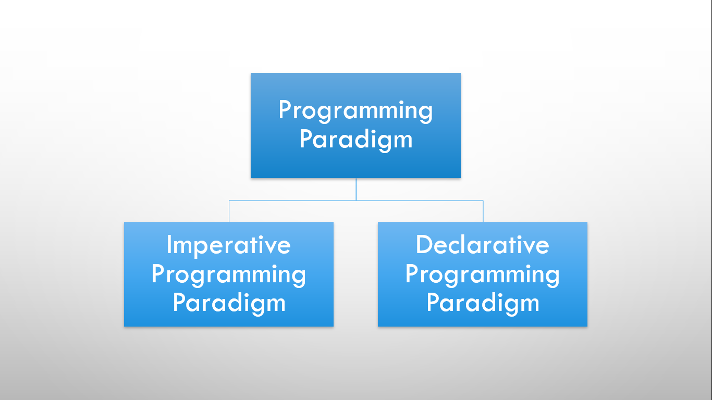
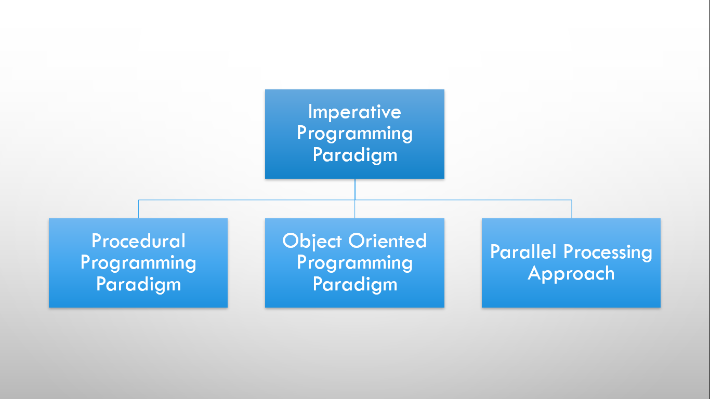
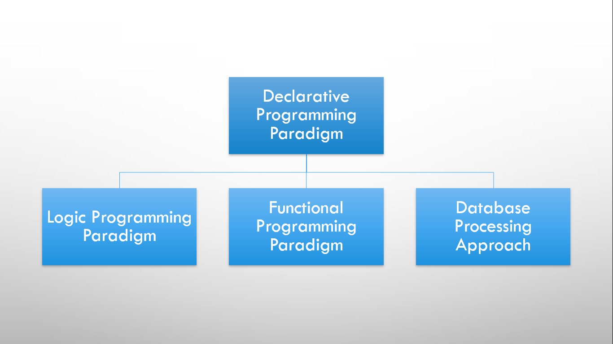
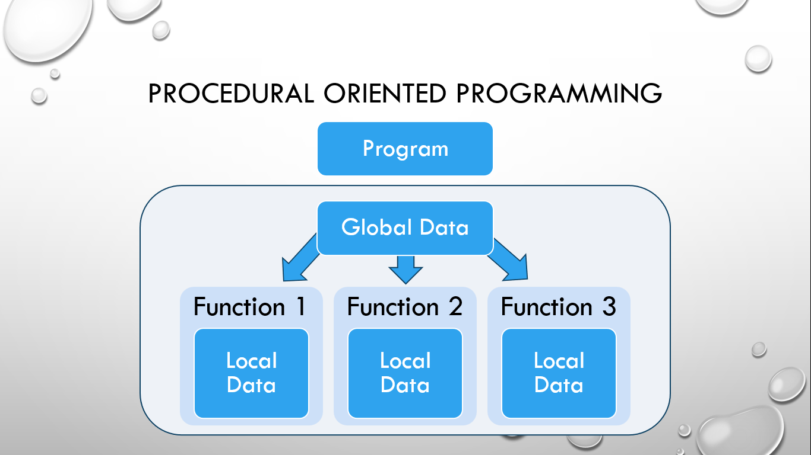
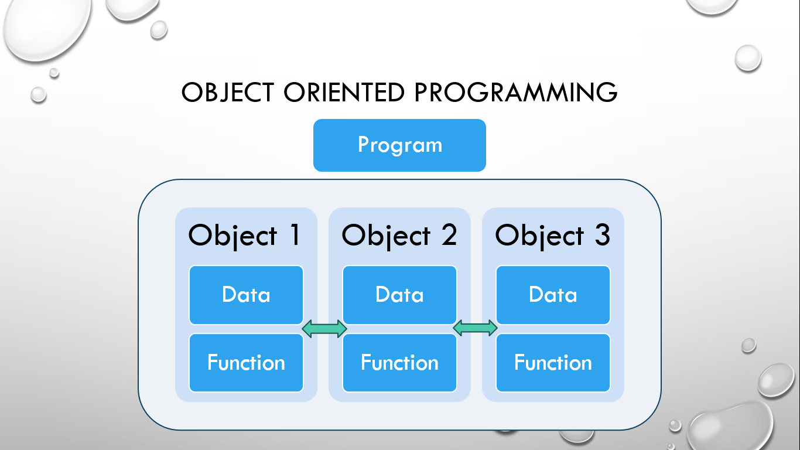

# ⚡Programming Paradigm

## What is a Programming Paradigm?

A paradigm can be termed as a method to solve some problem or do some task. Similarly, a Programming Paradigm is a method, style, or approach of programming to solve problems. They are mainly of two types: Imperative Programming Paradigm and Declarative Programming Paradigm.

## Types of Programming Paradigm

There are two major types of programming paradigms.

### 1. Imperative Programming Paradigm

It mainly consists of three programming paradigms.

#### a. Procedural Oriented Programming Paradigm

- More emphasis on procedures.
- Code reusability.
- Examples: C, Pascal, etc.

#### b. Object Oriented Programming Paradigm

- Collection of classes and objects.
- More emphasis on data rather than the procedure.
- Code reusability.
- Data security.

#### c. Parallel Processing Approach

- Program instructions are divided among multiple processors.
- Divide and Conquer approach.
- Example: NESL.

### 2. Declarative Programming Paradigm

It mainly consists of three programming paradigms.

#### a. Logic Programming Paradigm

- Abstract model of computation.
- Knowledge base and queries.
- Logic-based computation.
- Utilized in AI and Machine Learning models.
- Example: Prolog.

#### b. Functional Programming Paradigm

- Language independent.
- Roots in Mathematics.
- Computation based on Mathematical functions.
- Encapsulation and Hiding implementation.
- Referential Transparency.
- Examples: Perl, JavaScript, etc.

#### c. Database Programming Paradigm

- Data-centric programming methodology.
- Focuses on definition, query, manipulation, and control of data.
- Example: SQL.

## Imperative and Declarative Programming Paradigm

### 1. Imperative Programming Paradigm

- Oldest programming paradigm.
- Relates to machine architecture.
- Goal-oriented.
- Step-by-Step Execution i.e. Sequential Execution.
- Examples: C, Fortran, Basic, etc.

### 2. Declarative Programming Paradigm

- Emphasis on logic of computation.
- Focuses on what-to-do rather than how-to-do.
- Examples: Prolog, SQL, etc.

##

## Procedural-Oriented and Object-Oriented Programming Paradigm

### 1. Procedural Oriented Programming Paradigm

#### 

- The Whole program is divided into multiple functions.
- These functions are interdependent as well.
- Each and every function has its own local data and can share global data.
- Due to more movement of data, there is less data security.
- More focus is given to the algorithm part i.e. how-to-do tasks rather than data.
- Not suitable for large and complex scalable applications due to the interdependency of functions.
- Code reusability.
- Examples: C, Pascal, etc.

### 2. Object Oriented Programming Paradigm

#### 

- The Whole program is divided into parts i.e. objects.
- Data and function are wrapped into a single unit called Object.
- These objects can communicate with each other via message-passing techniques.
- Objects relate to a real-world entity like a pen, marker, bottle, products, etc.
- Data is more secure because of less movement of data.
- More focus is given to the data rather than the algorithm part.
- Different kinds of access specifiers i.e. Private, Public, and Protected are used for data security.
- Private means nobody can access the data, Public means anybody can access the data and Protected means only the selected users can access the data.
- Code reusability.
- Suitable for complex and scalable applications.
- Examples: C++, Java etc.
