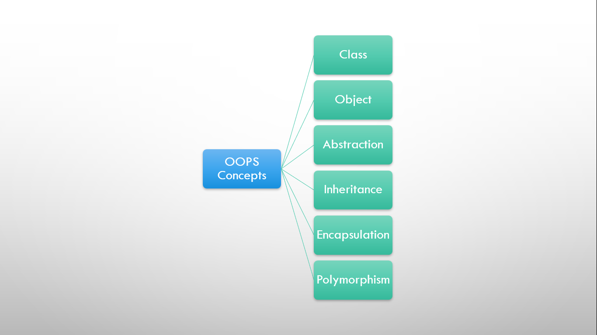
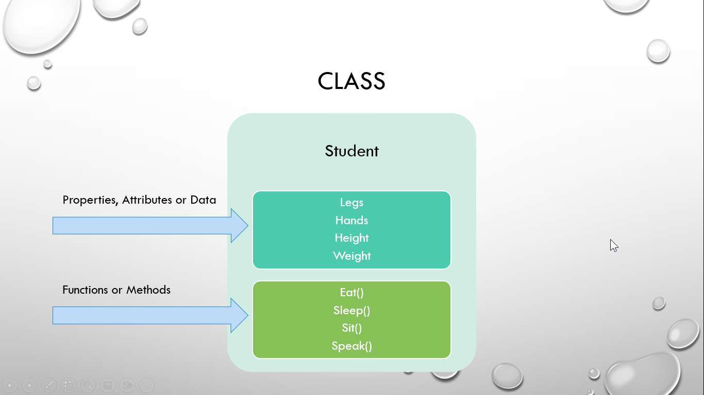
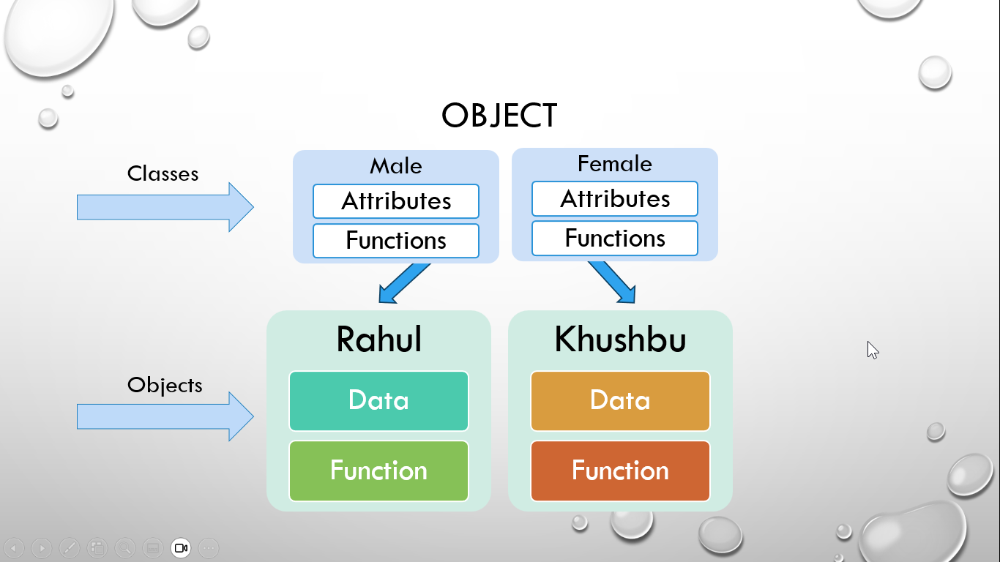
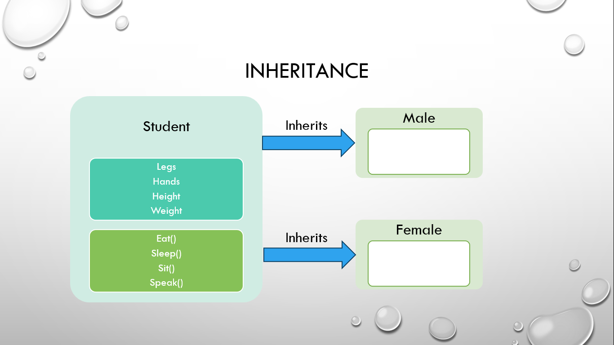
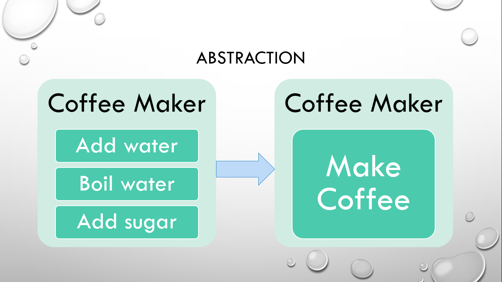
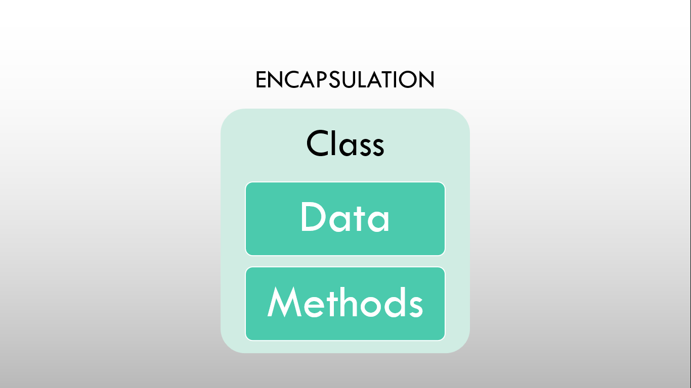
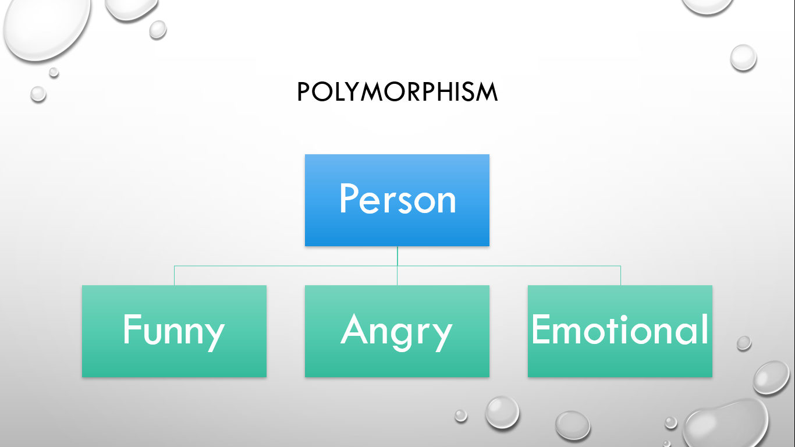

# ⚡Basic Overview on OOPs Concepts

## OOPS Concepts

There are six fundamental concepts of OOPs.

- Class
- Objects
- Abstraction
- Inheritance
- Encapsulation
- Polymorphism

## Class and Objects

### Class

#### 

- Class is just a blueprint, logical, definition, prototype thing through which we can create an object.
- Class is a user-defined datatype like a structure in the Procedural Oriented Programming Paradigm.
- Class consists of data and code.
- Data consists of properties or attributes and Code consists of methods or functions.
- The properties and functions of a class can be accessed using objects of these classes.
- They are a group of objects which share common properties or attributes.

### Object

#### 

- Objects are the instance or real-life entity created using class.
- Each object has its own data and function.
  Each object can interact with each other with the help of a message pass.
- For interacting, they don't need to have internal knowledge of each other data and code.

## Inheritance

#### 

- Using inheritance, a child class can inherit the data and code or common properties from the base class.
- Inheritance provides code reusability.
- Using inheritance, we can only manipulate the data of an object whose data and code are bound together in that object.

## Abstraction

#### 

- Abstraction includes hiding the implementation detail from the world and showing only the relevant details to the world.
- It includes hiding something in a function or interface.

## Encapsulation

#### 

- Encapsulation includes wrapping up data and functions into a single unit.
- We can hide this data from the outside world using an access specifier.
- Encapsulation provides data security and privacy.

## Polymorphism

#### 

- Polymorphism simply means having multiple forms of the same instance.
- They are of two types:
  - Overloading
  - Overriding
- Overloading example: the same function can have multiple forms that act and react differently according to the situation.
- Overriding example: a child class can implement function from the parent class according to its need.
