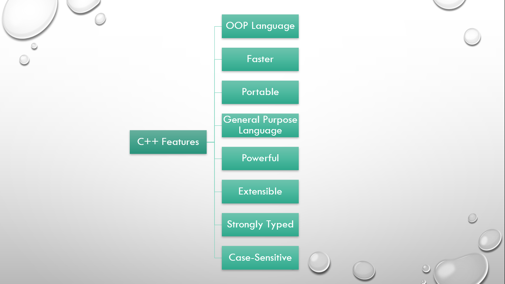
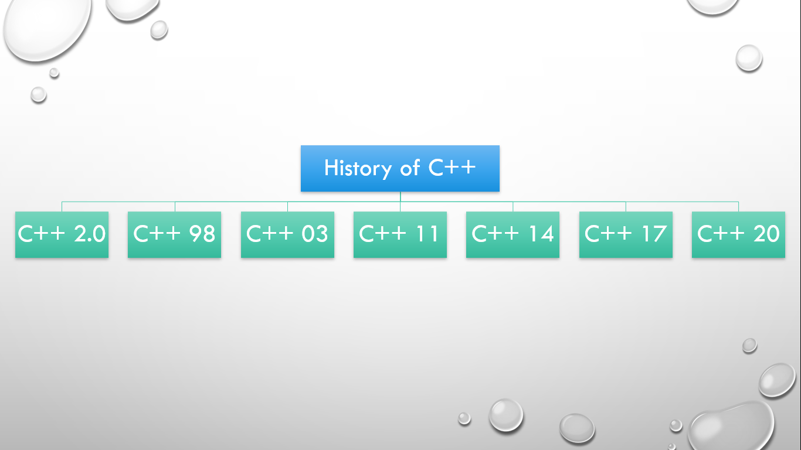

# ⚡Introduction, Features, and History of C++

## Introduction to C++

- C++ was developed by Bjarne Stroustrup (Danish Computer Scientist), since 1979 at Bell Labs.
- C++ was originally named "C with Classes".
- It is the extension or superset of C language.
- It supports multiple programming paradigms i.e. Procedural Oriented and Object-Oriented Programming Paradigm.
- It is not purely OOP language.
- It is a general-purpose programming language i.e. used for system as well as application-level programming.
- It is an intermediate or middle-level language.
- It is a compiled and OOP language.
- C++ 20 is the latest version which was released in 2020.
- Simula 79 was the first OOP Language.

## Features of C++

#### 

- It supports OOP.
- It is a general-purpose programming language i.e. used in system-level as well as application-level programming.
- It is faster than other programming languages such as Python and Java.
- It is a middle-level language i.e. supports both low-level and high-level.
- It is portable i.e. machine independent but platform dependent.
- It is a powerful and robust programming language i.e. we can use pre-defined functions, create our own datatypes, etc.
- It is extensible i.e. we can add our own functions to a library.
- It supports pointers and dynamic memory allocation.
- It is strongly typed language i.e. we need to declare before using.

## History of C++

#### 

- C++ was originally named "C with Classes".
- It was renamed C++ in 1983.
- The first commercial version of C++ i.e. C++ Programming Language was released in 1985.
- C++ 2.0 was released in 1989 (features protected and static members, multiple inheritance, etc).
- A reference manual was released in 1990 and in the same year, the Borland Turbo C++ compiler was released.
- The first international standard of C++ i.e. C++ 98 was released in 1998 (features STL i.e. Standard Template Library).
- C++ 03 was released in 2003.
- A technical report was released in 2005.
- C++ 11 was released in 2011 (features auto keyword and lambda expressions).
- C++ 14 was released in 2014.
- C++ 17 was released in 2017 (features new header files and libraries).
- C++ 20, the latest release was released in 2020 (features a three-way comparison operator).
