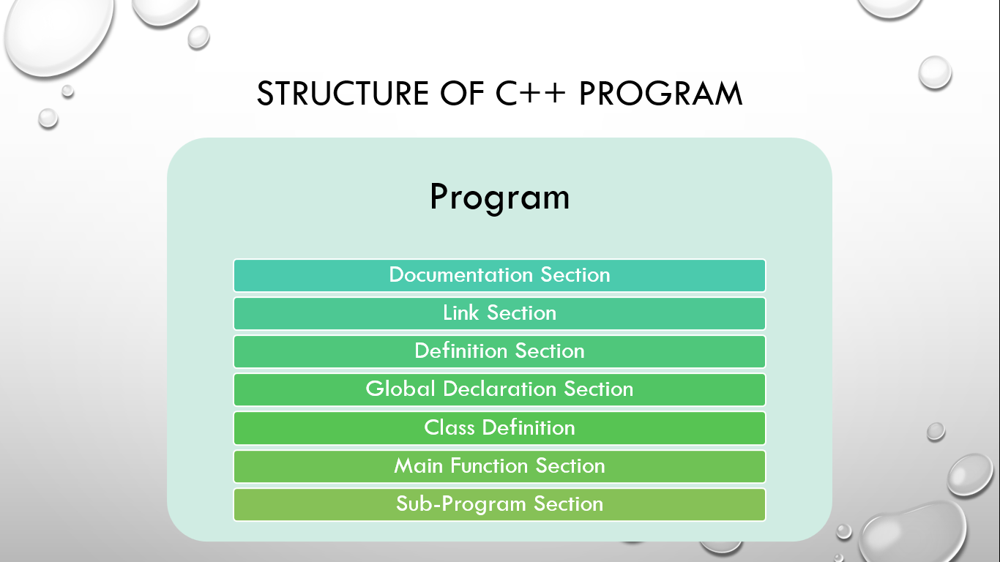

# ⚡Structure of C++ Program

#### 

## Documentation Section

This section features general information about the program such as who is the author of the program?, and what is the program about. So, it gives a basic overview of a program without actually looking through line by line of code. But this is not mandatory. It is written using comments that might be single-line or multiline comments.

## Link Section

There are two sections in the link section in the C++ program. It includes a header and namespace. In order to use such pre-defined elements in a program, an appropriate header must be included in the program. For example: the <iostream> header is used for accessing standard streams. A namespace permits the grouping of various entities like classes, objects, functions, and various C++ tokens, etc. under a single name. Namespaces can be accessed in multiple ways i.e. using namespace std; or using std :: cout;. This is compulsory.

## Definition Section

This section features a declaration of constants, user-defined data type, and macro definition like #define. This is optional.

## Global Declaration Section

This section features a declaration of global variables and class definitions. The scope of the variable declared in this section lasts all over the program. Similarly, these variables are accessible within the user-defined functions. This is also optional.

## Class Definition

This features of definition of data members and the member function of a class. This is also optional.

## Main Function Section

This section is the starting point of C++ programs, containing all the executable statements within its curly braces {}. When the program runs, the compiler sequentially executes the instructions in the main function. After completing these instructions, the program terminates, and no further execution occurs. This is compulsory.

## Sub-Program Section

This section features additional functions i.e. user-defined functions. This is also optional.

## Example

```cpp
// Author: Ashish Shrestha
/*
Written on 29th July 2022
Program to demonstrate basic structure of C++ program
*/

#include <iostream>
#define PI 3.14

int rad = 2;
void area();

class myClass
{
public:
  int a;
  void display()
  {
    std::cout << "Inside of class" << std::endl;
  }
};

int main()
{
  myClass m;
  m.a = 90;
  m.display();
  area();
  std::cout << "Hello World" << std::endl;
  std::cout << m.a << std::endl;
  return 0;
}

void area()
{
  float area;
  area = PI * rad * rad;
  std::cout << area << std::endl;
}
```
