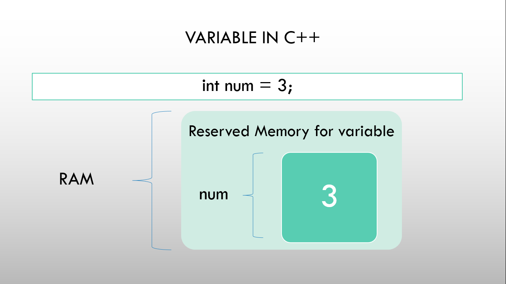
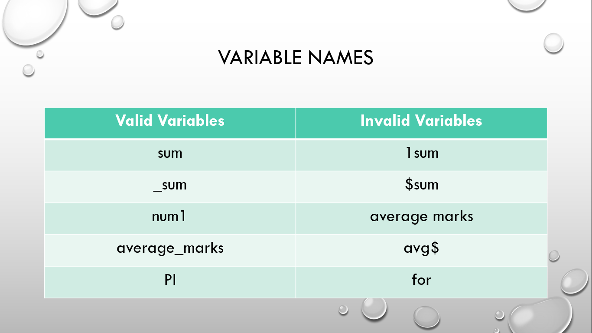
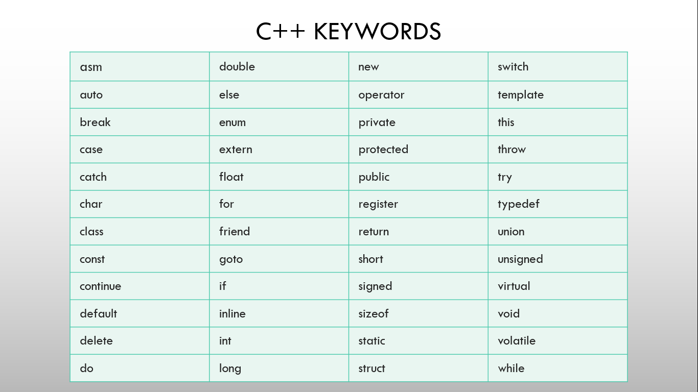

# ⚡Constants, Variables, Keywords and Identifiers

## Constants

- Constants are the fixed values i.e. we cannot change their values during the execution of the program.
- Constants can be of two types i.e. numeric constant and character constant.
- Numeric constants include integers such as 0, -2, 30, etc., and real/floating point values such as 1.1, 3.14, etc.
- Character constants includes character written in the single quote ('') such as 'A', '#' etc., and string constants includes characters written in the double quote ("") such as "Lambda", "a" etc.
- We can declare constants using const keyword or #define for a macro.
- Structure: const variable_name; | #define variable_name value

## Variables

#### 

- Variables are the name given to a memory location where we store the data.
- The values of a variable can be changed during the execution of the program.
- Variables are declared using various naming conventions.
- Variables are of three types i.e. Local, Instance, and Static variables.
- Local variables are defined within a block, method, or constructor.
- Instance variables are defined in a class outside of any method.
- Static variables are the class variables declared using static keywords within a class.
- Structure: datatype variable_name;

## Identifiers

- Identifiers are the names given to variables, functions, arrays, classes, etc.
- The naming convention for identifiers are same as variables.
- Also, there are pre-defined identifiers which are the name predefined such as include, iostream, cout, main, etc.

## Naming convention for Variables and Identifiers

#### 

- They should contain letters (a-z/A-Z), digits (0-9) or underscore( \_ ).
- They are case-sensitive i.e. lowercase and uppercase are two different things.
- The name should start with a letter (a-z/A-Z) or underscore( \_ ).
- No whitespaces and use of special characters are allowed (except underscore).
- Keywords cannot be used for naming.

## Keywords

#### 

- Keywords are the words that are reserved or predefined.
- Keywords always start in lowercase.
- They define the type of entity.
- Unlike identifiers, no special symbols, or punctuations are used in keywords.
- Some keywords are int, char, while, do, etc.
