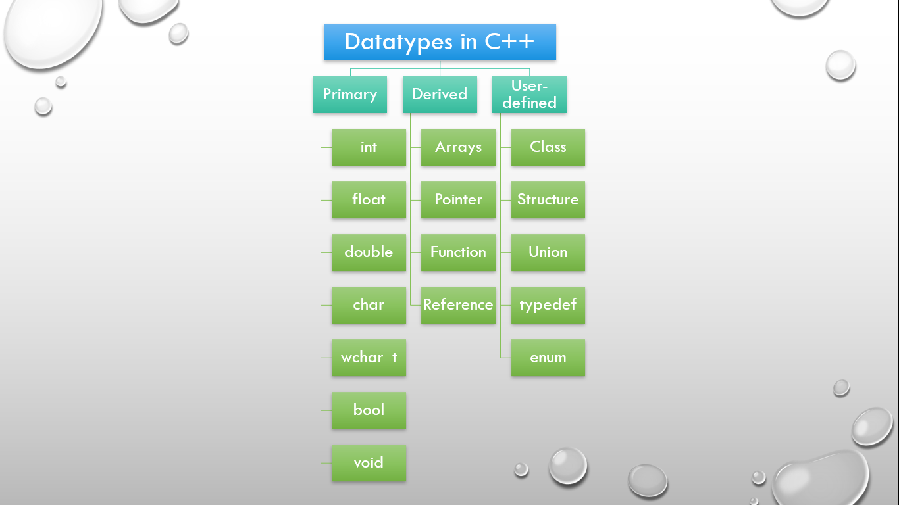
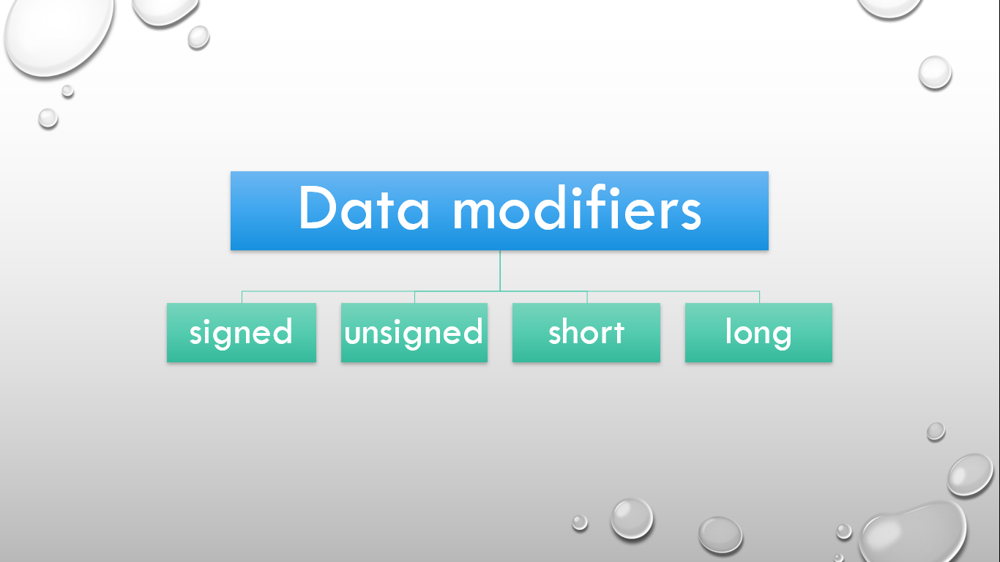
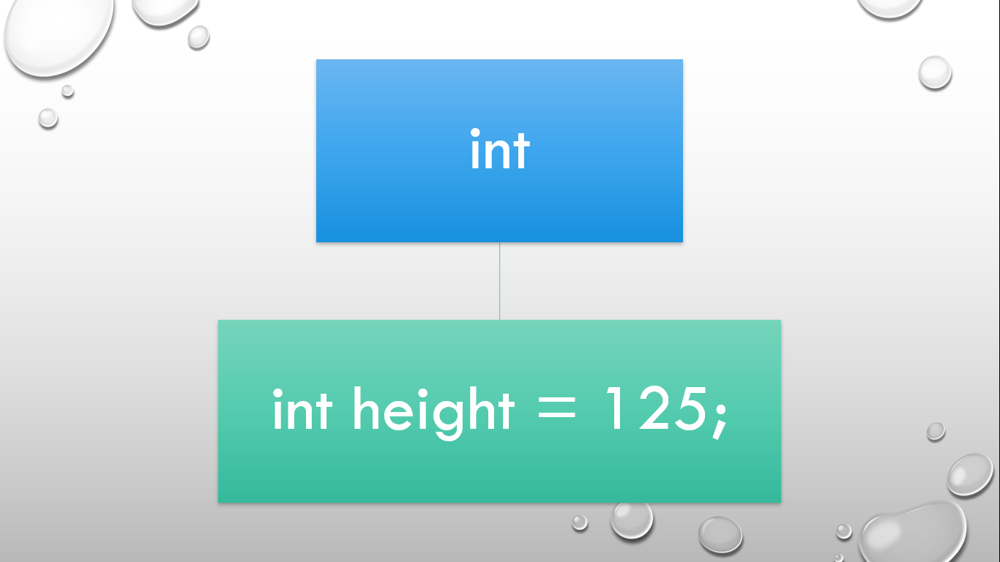
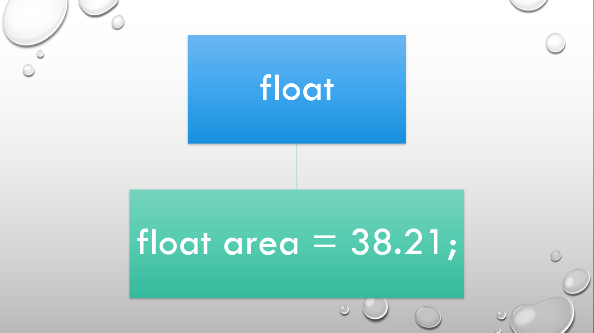
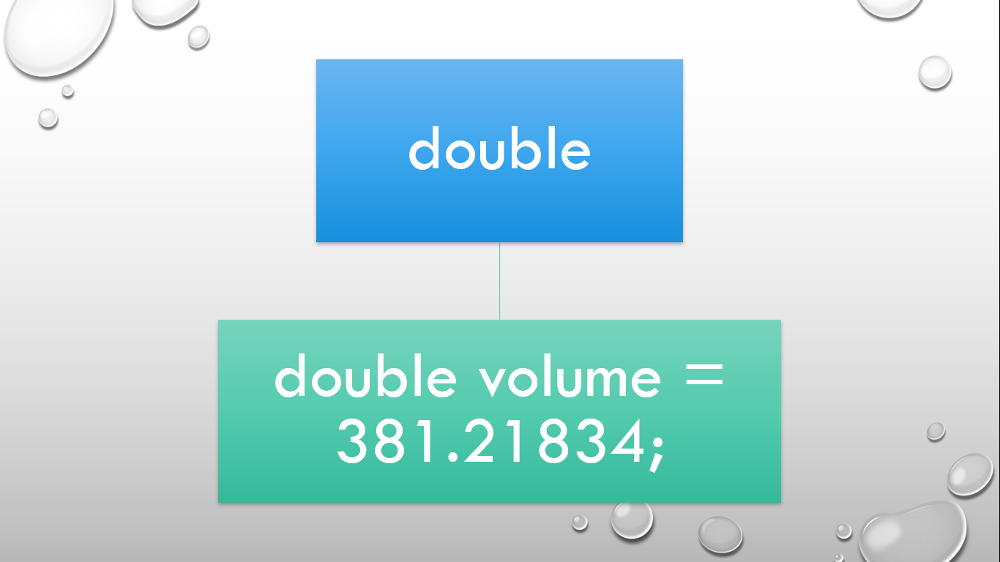
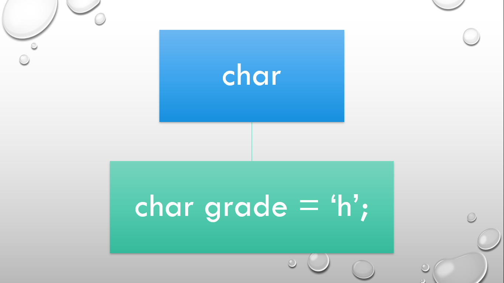
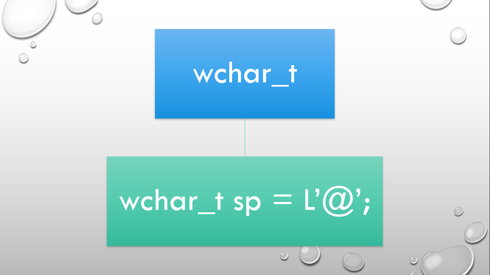
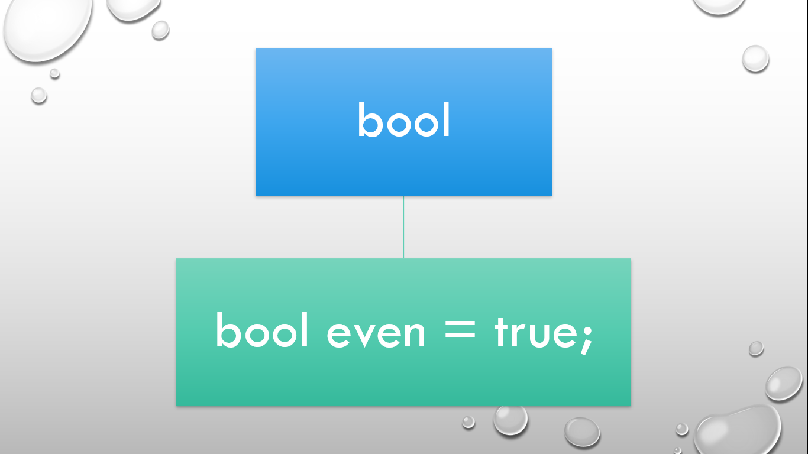
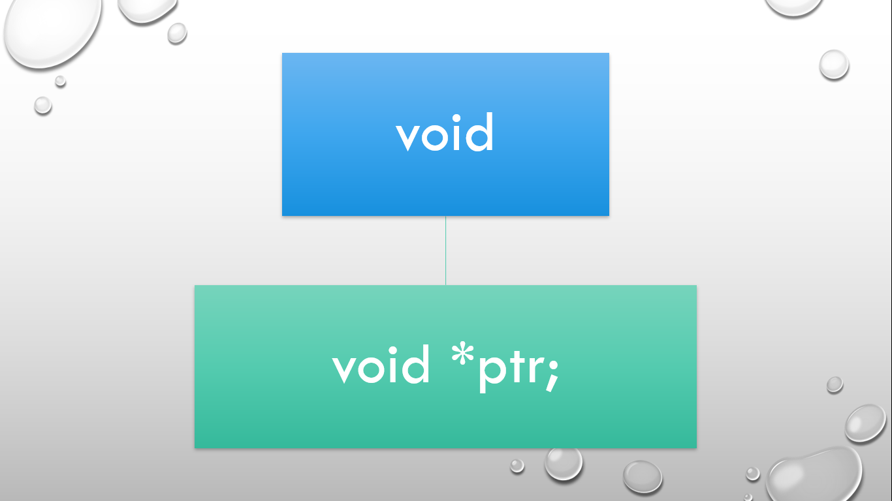

# ⚡Datatypes in C++

## Datatypes

#### 

- Datatypes specify the size and type of value to be stored in memory.
- Syntax: datatype variable_name;
- There are three types of datatypes i.e. Primary, Derived and User-defined datatype.
- We have int, float, double, char, wchar_t(wild character), bool(boolean), and void in primary datatypes.
- We have arrays, pointer, function and reference in derived datatypes.
- We have class, structure, union, typedef and enum in user-defined datatypes.

## Data modifiers

#### 

- Data modifiers are used to modify the length of data that an Integer, Double or Character data type can hold.
- They are used with the Integer, Double and Character datatype.
- We have basically four data modifiers i.e. signed(negative values), unsigned(postive values), short and long.

## int

#### 

- Size: 4 bytes(in general) i.e. 32 bits.
- Examples: 0, -1, 3 etc.
- short int size: 2 bytes i.e. 16 bits.
- long int size: 4 bytes.
- long long int size: 8 bytes.

## float

#### 

- Size: 4 bytes
- Precision upto 7 digits.

## double

#### 

- Size: 8 bytes
- Precision upto 15 digits.

## long double

- Size: 12 bytes
- Precision upto 18 digits

## char

#### 

- Size: 1 byte i.e. 8 bits
- based on ASCII code.

## wchar_t (wild character)

#### 

- Size: 2 bytes or 4 bytes(depends upon compiler).
- based on unicode.

## bool

#### 

- can take the values true or false.
- 1 is for true and 0 is for false.
- Anything other than 0 is considered true.

## void

#### 

- It include empty set of values.
- When used with function, void specifies that function doesn't return a value.
- When used with pointer, void specifies that pointer is universal.
