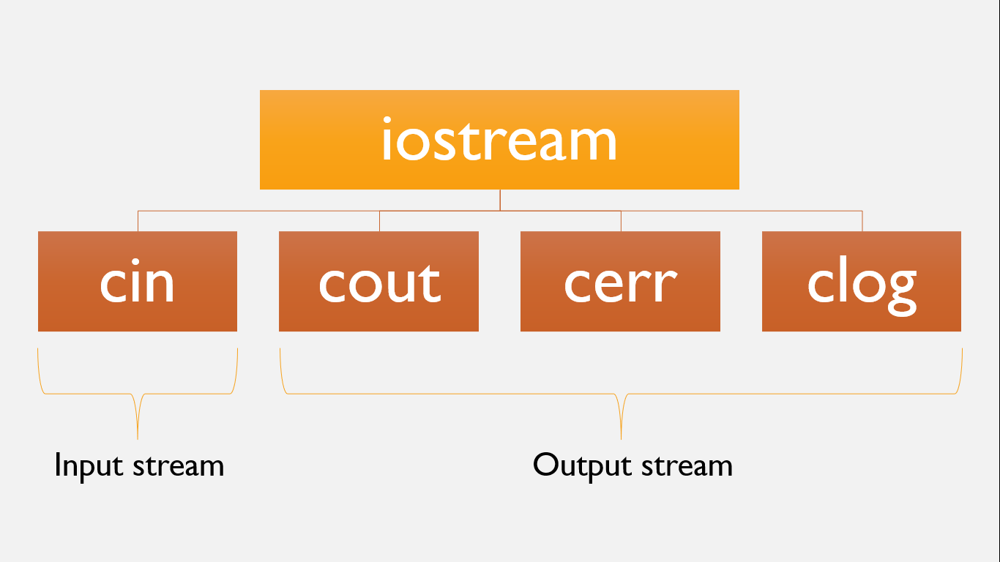
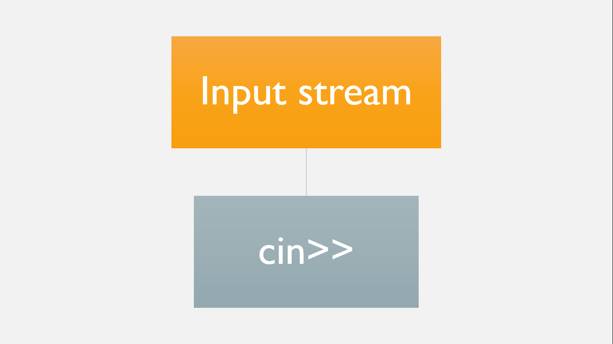
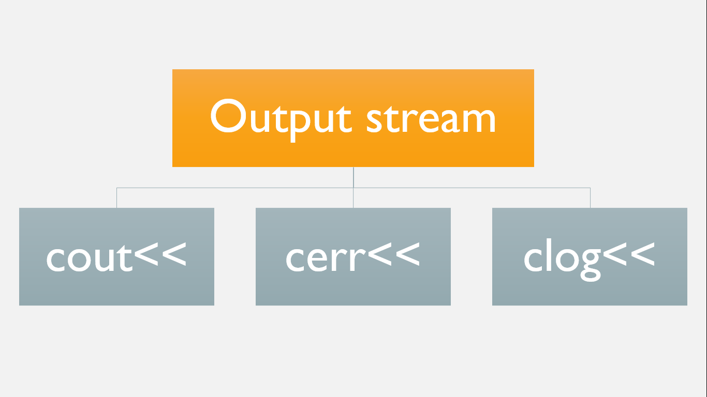

# ⚡Input and Output in C++

## Stream

#### 

- In C++, input and output are performed in the form of a sequence of bytes i.e. called stream.
- There are commonly two type of streams i.e. input stream(istream) and output stream(ostream).

## Input stream

#### 

- It is the flow of bytes from input device to the main memory.
- It consists object 'cin'.
- Keyboard is used for standard input.

## Output stream

#### 

- It is the flow of bytes from main memory to output device.
- It consists of object like 'cout', 'cerr', and 'clog'.
- Screen is used for standard output.

## iostream header

- The standard input and output is performed using header iostream.
- It is a standard library which consists four standard input output objects i.e. 'cin', 'cout', 'cerr' and 'clog'.

## Insertion and Extraction operator

- '<<' is known as insertion operator.
- '>>' is known as extraction operator.

### Examples

```cpp
// program to print hello world
#include <iostream>
int main()
{
  std::cout << "hello world";
  return 0;
}
```

```cpp
// program to take two numbers and display them
#include <iostream>
using namespace std;
int main()
{
  int firstNum, secondNum;
  cout << "Enter two numbers:" << endl;
  cin >> firstNum >> secondNum;
  cout << "First number: " << firstNum << endl;
  cout << "Second number: " << secondNum << endl;
  return 0;
}
```
