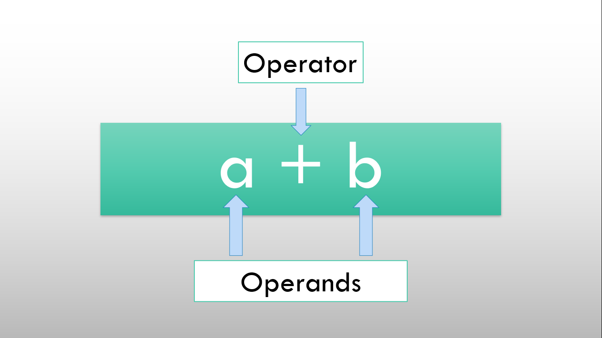
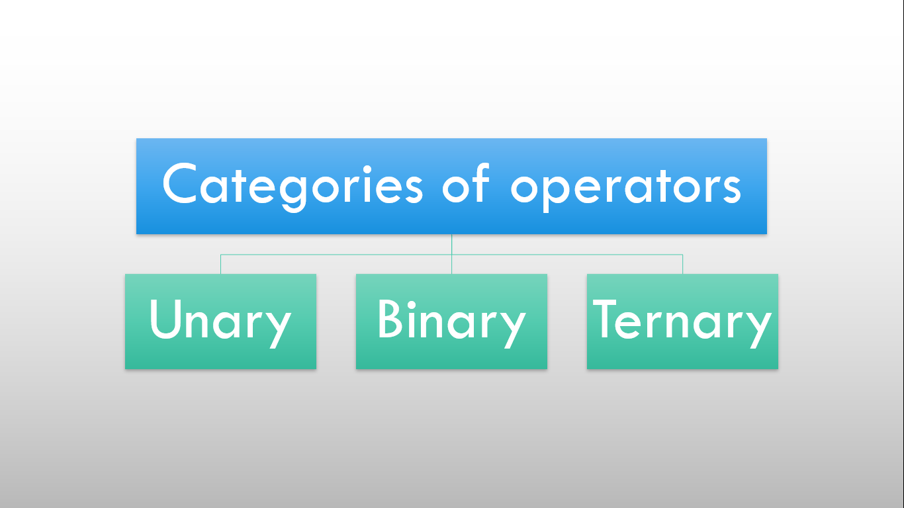
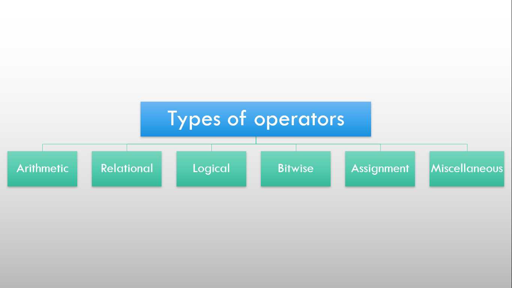
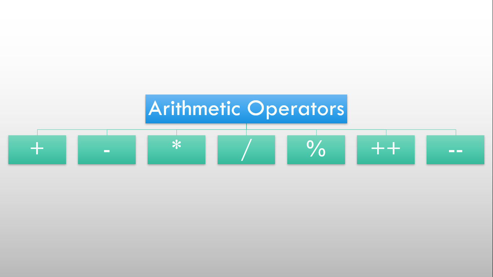
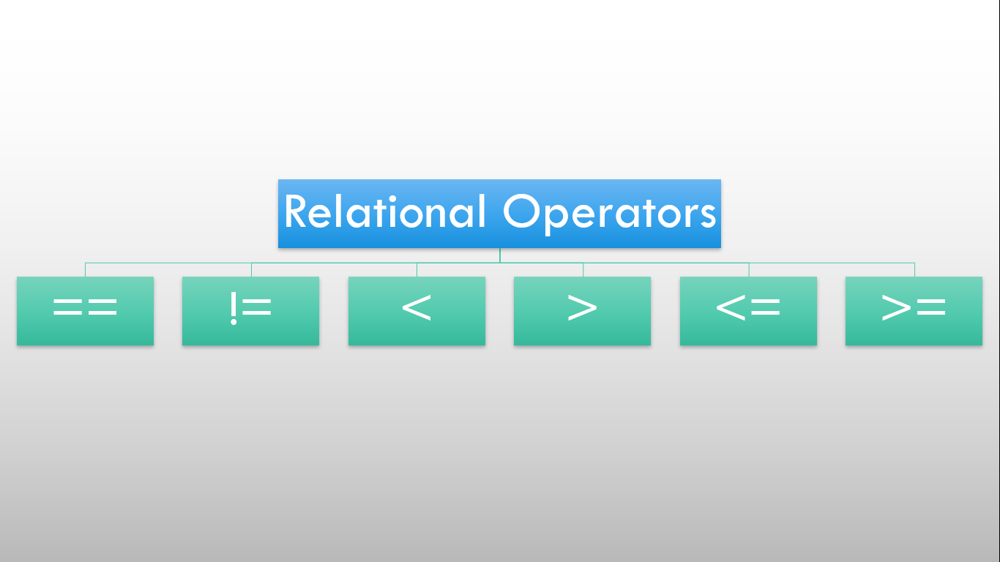
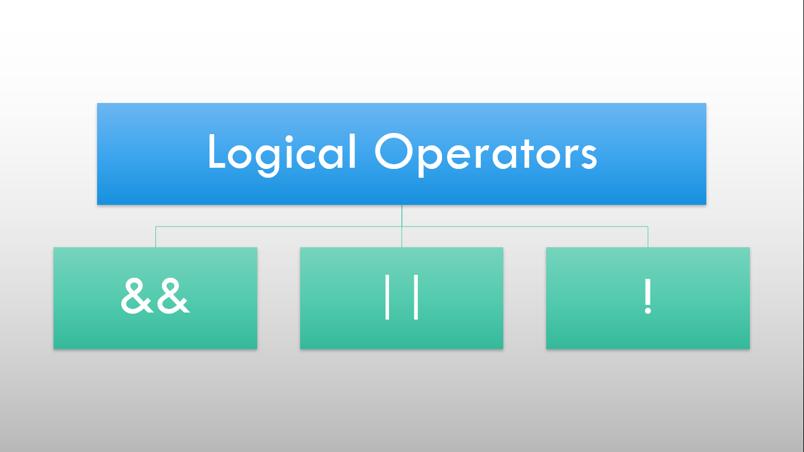
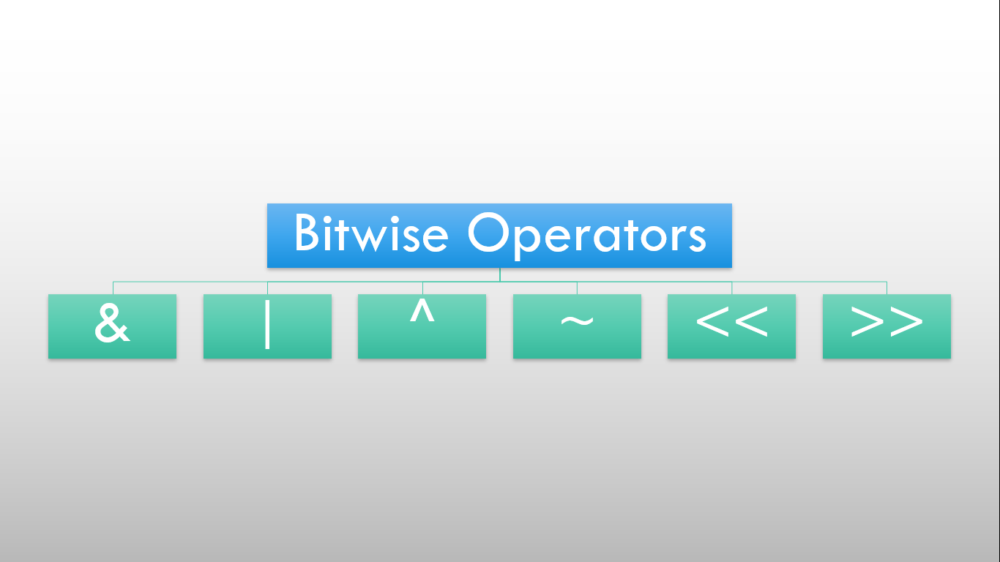
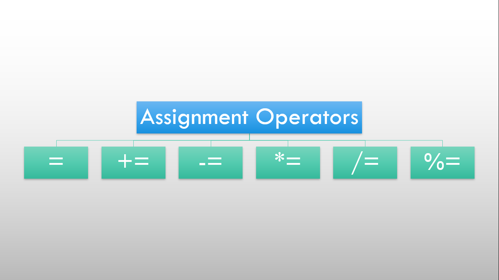
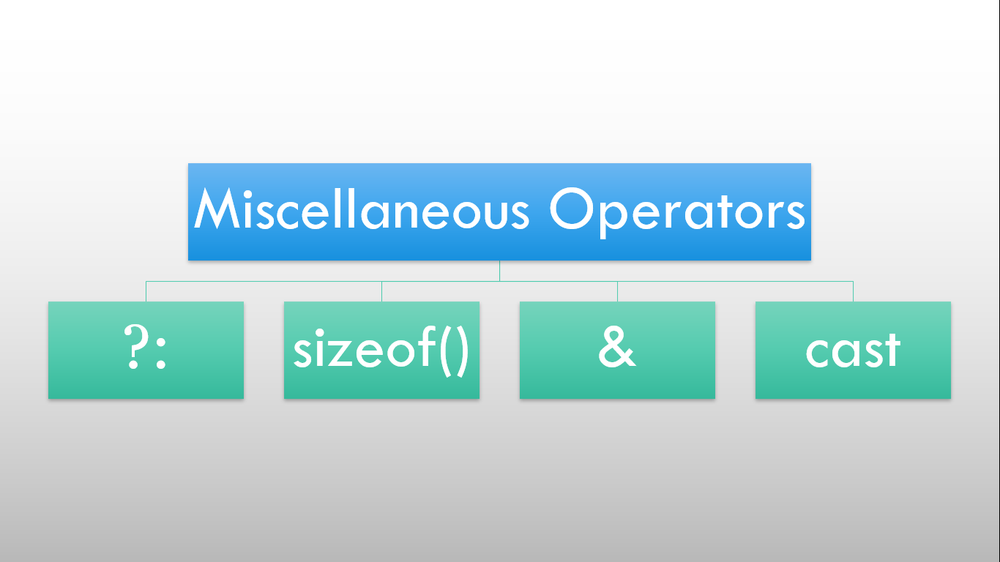

# ⚡Operators in C++

## Operators and Operands

## 

- Operator is a symbol that operates on a value to perform specific mathematical or logical computations.
- Operands are the data on which operations are to be performed.

## Categories of operators

## 

- Unary operator(require 1 operand)
- Binary operator(require 2 operands)
- Ternary operator(require 3 operands)

## Types of operators

## 

- Arithmetic operator
- Relational operator
- Logical operator
- Bitwise operator
- Assignment operator
- Miscellenous operator

## Arithmetic operator

## 

- These operators are used to perform arithmetic or mathematical operations on the operands.
- It includes '+', '-', '\*', '/', '%'(modulo), '++'(increment operator) and '--'(decrement operator).
- These increment and decrement operator includes pre and post increment/decrement operations.
- For example, in ++a(pre-increment), the value of the variable is incremented first and then is used in the program. In a++(post-increment), the value of the variable is assigned first and then it is incremented. Similarly happens for the decrement operator.

## Relational operator

## 

- These operators are used for the comparison of the values of two operands.
- It includes '=='(is equal to), '!='(not equal to), '<'(less than), '>'(greater than), '<='(less than or equal), '>='(greater than or equal).

#### Example

```cpp
a = 3, b = 10
a == b (false)
a != b (true)
a < b (true)
a > b (false)
a <= b (true)
a >= b (false)
```

## Logical operator

## 

- These operators are used to combine two or more conditions.
- It includes three operators i.e. '&&'(logical AND), '||'(logical OR), '!'(logical NOT).
- '&&' returns true if all operands are true.
- '||' returns true if one operand is true.
- '!' returns true if the operand is false or zero.
- AND and OR logical operators are based on boolean values and operates on short-circuit evaluation i.e. for 'AND', if one operand is false, it will not evaluate the rest operands and for 'OR', if one operand is true, it will not evaluate the rest operands.

#### Example

```cpp
a = 3, b = 10, c = 8
(a > b) && (a > c) => false
(a < b) || (a > c) => true
!a => false
```

## Bitwise operators

## 

- These operators performs bit-level operations on the operands.
- It includes six operators i.e. '&'(bitwise AND), '|'(bitwise OR), '^'(bitwise X-OR), '~'(bitwise NOT), '<<'(bitwise left shift), '>>'(bitwise right shift).
- '&' returns true if all operands are true.
- '|' returns true if one operand is true.
- '^' returns false if both operands are true or false.
- '~' returns true if the operand is false or zero and vice-versa.
- '<<' shifts the value to left by the number of bits specified by the left operand.
- '>>' shifts the value to right by the number of bits specified by the right operand.

## Assignment operator

## 

- These operator assigns the value of the right hand side to the variable on the left hand side.
- It includes '='(assignment), '+='(add and assignment), '-='(subtract and assignment), '\*='(multiply and assignment), '/='(divide and assignment), '%='(modulo and assignment).

## Miscellenous operators(conditional, sizeof(), address, casting)

## 

- Conditional operator includes ternary operator (?:) i.e. condition?expression1:expression2.
- sizeof() operator gives size of datatype or variable.
- address operator(&) gives address of a variable. [pointers]
- casting operator forcefully convert one datatype into another.
