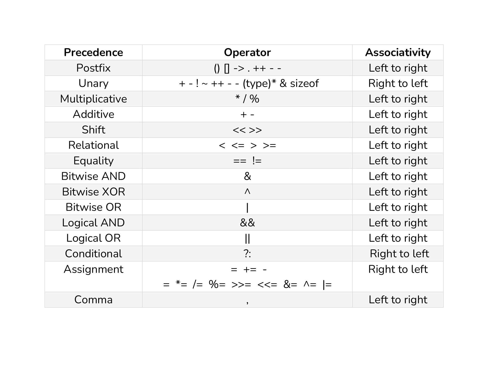

# ⚡Operators Precedence and Associativity in C++

## 

## Operators Precedence

If there are multiple operators in a single expression, the operations are not evaluated simultaneously. Rather, the operators with higher precedence or priority have their operations evaluated first.

## Operators Associativity

Operator associativity is the direction from which an expression is evaluated.

#### Note: Similarly, the order of evaluation depends on the compiler and the program may show undefined behaviour in case of evaluation of expression having increment and decrement operator.

## Example 1:

```cpp
a = 2 + 3 * 5
solving:
a = 2 + 3 * 5
a = 2 + 15
a = 17
```

## Example 2:

```cpp
b = (2 + 3) * 5
solving:
b = (2 + 3) * 5
b = 5 * 5
b = 25
```

## Example 3:

```cpp
c = 2 + 3 * 5 / 2 % 3
solving:
c = 2 + 3 * 5 / 2 % 3
c = 2 + 15 / 2 % 3
c = 2 + 7 % 3
c = 2 + 1
c = 3
```

## Example 4:

```cpp
d = 2 + 3 | 12 / 6 - 1 << 1 && 6 % 7 / 3 * 5
solving:
d = 2 + 3 | 12 / 6 - 1 << 1 && 6 % 7 / 3 * 5
d = 2 + 3 | 2 - 1 << 1 && 6 % 7 / 3 * 5
d = 2 + 3 | 2 - 1 << 1 && 6 / 3 * 5
d = 2 + 3 | 2 - 1 << 1 && 2 * 5
d = 2 + 3 | 2 - 1 << 1 && 10
d = 5 | 2 - 1 << 1 && 10
d = 5 | 1 << 1 && 10
d = 5 | 1 << 1 && 10
d = 5 | 2 && 10
d = 7 && 10
d = 1
```
