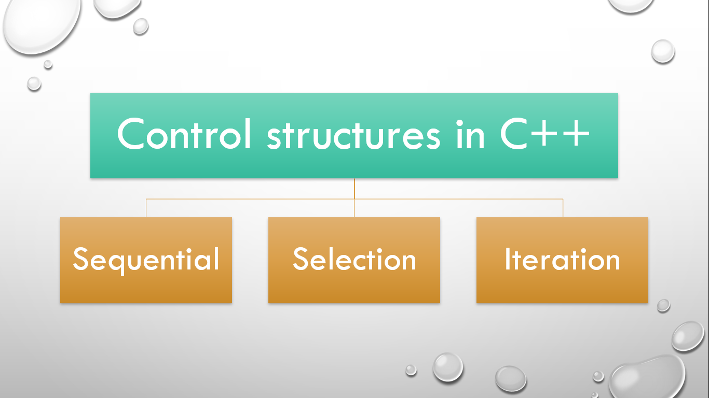
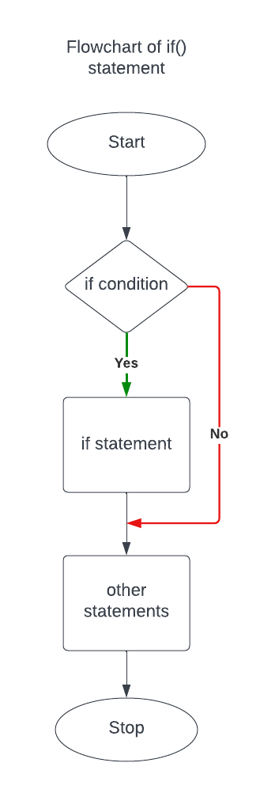
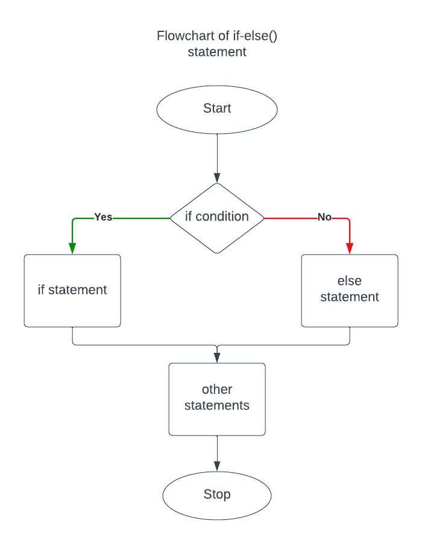
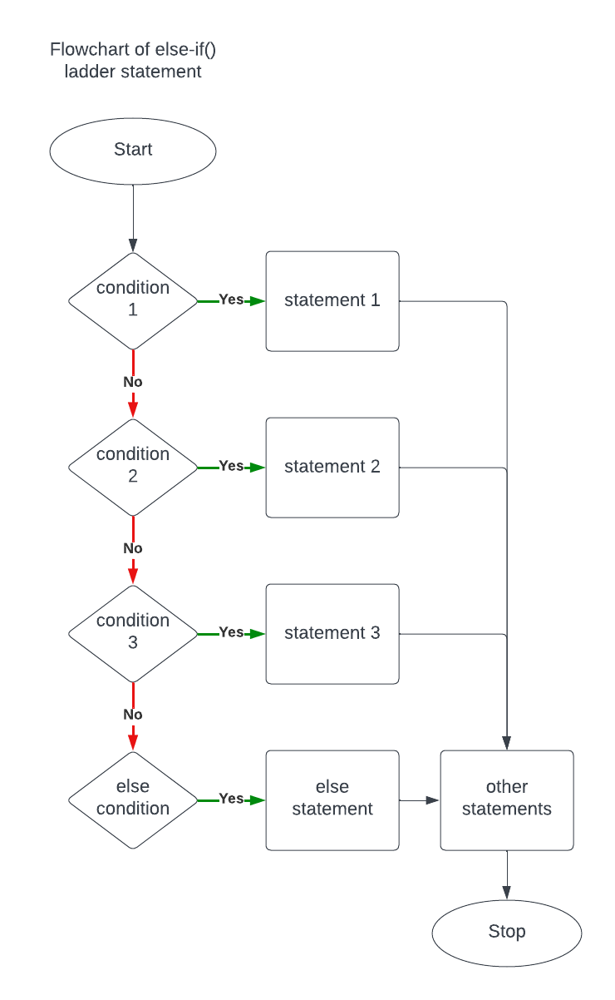
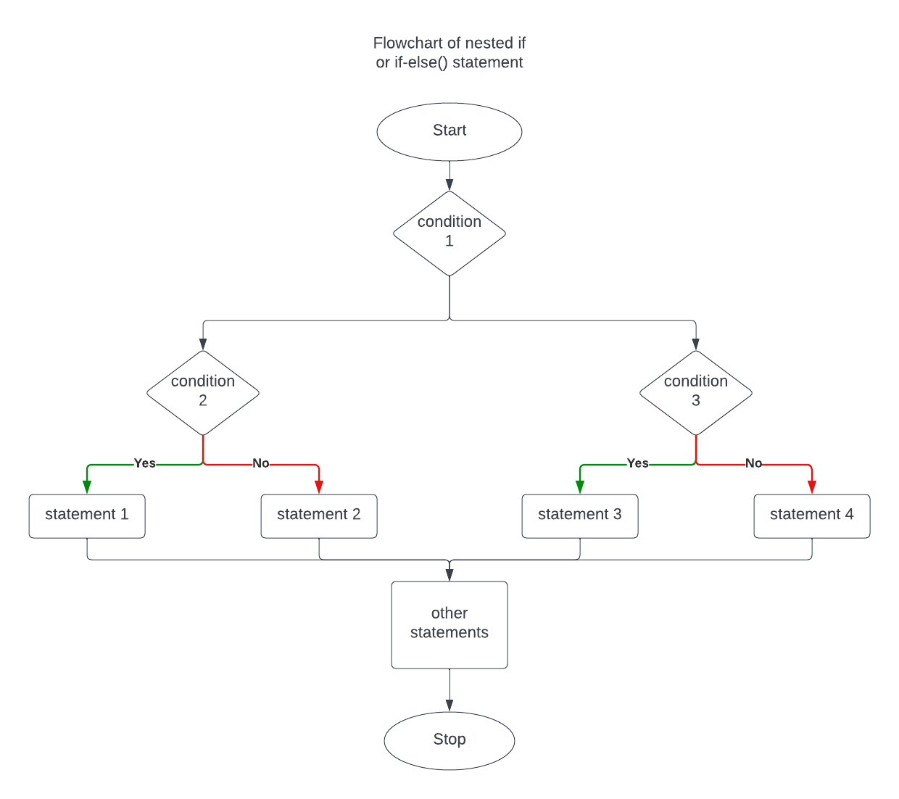

# ⚡Control Structures in C++

## 

## Control structures

- Control Structures are just a way to specify flow of control in programs.
- There are three types of control structures in C++ i.e.
  - Sequential
  - Selection
  - Iteration.

## Selection or Decision control structures

- This structure specify flow of control based on the condition defined.
- They are of five types:
  - if
  - if-else
  - else-if ladder
  - nested if-else
  - switch

## if() statement

## 

- It is used to decide whether a certain statement or block of statements will be executed or not i.e if a certain condition is true then a block of statements is executed otherwise not.

#### Syntax:

```cpp
  if(condition)
  {
    // Statements to execute if condition is true
  }
```

## if-else() statement

## 

- It consists of two blocks, one for false expression and one for true expression.

#### Syntax:

```cpp
  if(condition)
  {
    // Statements to execute if condition is true
  }
  else
  {
    // Executes this block if condition is false
  }
```

## else-if() ladder statement

## 

#### Syntax:

```cpp
  if (condition 1)
  {
    statement 1;
  }
  else if (condition 2)
  {
    statement 2;
  }
  else
  {
    statement;
  }
```

## Nested if-else() statement

## 

- Nested if statements mean an if statement inside another if statement and Similarly for a if-else() and else-if() ladder statements.

#### Syntax:

```cpp
  if (condition1)
  {
    // Executes when condition1 is true
    if (condition2)
    {
      // Executes when condition2 is true
    }
    else
    {
      // Executes when condition2 is false
    }
  }
```

## Programs

```cpp
// program to have coffee in cafe if money is greater than 100

#include <iostream>
using namespace std;

int main()
{
  int money;
  cout << "Your money: ";
  cin >> money;
  if (money > 100)
  {
    cout << "Have a coffee in cafe" << endl;
  }
  cout << "Go home!" << endl;
  return 0;
}
```

```cpp
// program to have coffee in cafe if money is greater than 100 otherwise have a black tea in tea stall

#include <iostream>
using namespace std;

int main()
{
  int money;
  cout << "Your money: ";
  cin >> money;
  if (money > 100)
  {
    cout << "Have a coffee in cafe" << endl;
  }
  else
  {
    cout << "Have a black tea in tea stall" << endl;
  }
  cout << "Go home!" << endl;
  return 0;
}
```

```cpp
/* program to have :
- Veg MOMO if money is greater than 100
- Paneer MOMO if money is greater than 110
- Chicken MOMO if money is greater than 120
*/

#include <iostream>
using namespace std;

int main()
{
  int money;
  cout << "Your money: ";
  cin >> money;
  if (money > 100)
  {
    cout << "Have a Veg MOMO" << endl;
  }
  else if (money > 110)
  {
    cout << "Have a Paneer MOMO" << endl;
  }
  else if (money > 120)
  {
    cout << "Have a Chicken MOMO" << endl;
  }
  cout << "Go home!" << endl;
  return 0;
}
```

```cpp
/* program to buy icecream if you have money
- You can buy one cone of icecream if you have money Rs. 50
- You can buy two cones of icecream if you have money greater than Rs. 50
*/

#include <iostream>
using namespace std;

int main()
{
  int money;
  cout << "Your money: ";
  cin >> money;
  if (money)
  {
    if (money == 50)
    {
      cout << "One cone of icecream" << endl;
    }
    else if (money > 50)
    {
      cout << "Two cones of icecream" << endl;
    }
  }
  else
  {
    cout << "No money" << endl;
  }
  return 0;
}
```
