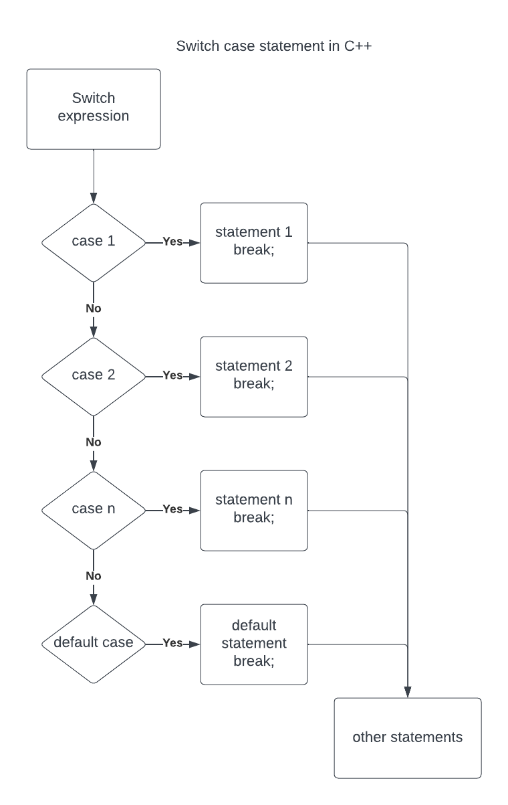

# ⚡Switch case statement in C++

## Switch case statement

## 

- The switch case statement executes the different blocks of statements based on the value of the given expression.
- It is used as an alternative to long else-if() ladder statement.
- Syntax:

```cpp
  switch(expression)
  {
    case value 1:
      statement 1;
      break;
    case value 2:
      statement 2;
      break;
    case value n:
      statement n;
      break;
  default:
      default statement;
  }
```

## Rules of the switch case statement in C++

- Expression value must be either int or char type.
- Expression value must be constant.
- Duplicate case values are not allowed.
- Comparision, Logical and Relational operators are not allowed for case values.
- 'break' keyword is used to terminate switch statement (to comeout of switch statement).

## Program

```cpp
/*
Program to select dish using switch case statement.
  1. Ham
  2. Shrimp
  3. Rice
  4. Spaghetti
*/

#include <iostream>
using namespace std;

int main()
{
  int dish;
  cout << "Which dish? ";
  cin >> dish;
  switch (dish)
  {
  case 1:
    cout << "Ham" << endl;
    break;
  case 2:
    cout << "Shrimp" << endl;
    break;
  case 3:
    cout << "Rice" << endl;
    break;
  case 4:
    cout << "Spaghetti" << endl;
    break;
  default:
    cout << "Dish not available" << endl;
  }
  cout << "Thankyou for visiting us.";
  return 0;
}
```
