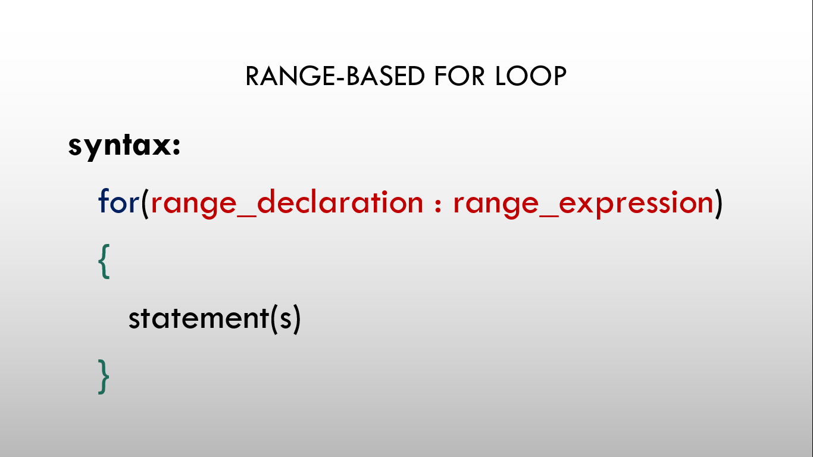

# ⚡Range-Based for() loop

## Range based for() loop

## 

- It was added since C++ 11.
- It executes for() loop over a range.
- It is used as a more readable equivalent to the traditional for() loop operating over a range of values, such as all elements in a container.

## Syntax

```cpp
for(range_declaration : range_expression)
{
  statement(s)
}
```

## range_declaration

range_declaration is a declaration of a named variable, whose type is the type of the element of the sequence represented by range_expression, or a reference to that type. It often uses the auto specifier for automatic type deduction.

## range_expression

range_expression is any expression that represents a suitable sequence.

## Example

```cpp
int a[] ={3, 2, 1};
for(int b:a)
{
  cout<<b<<endl;
}
```

The above example will print out the values of array a i.e. 3, 2, and 1.
