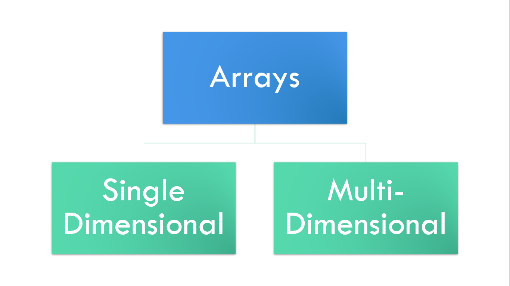

# ⚡Arrays

## Arrays

## 

- Arrays are used to store multiple values in a single variable, instead of declaring separate variables for each value.
- The elements of an array is defined with index starting from 0.
- Arrays is of two types mainly i.e. Single dimensional(1-D) and Multidimensional.

## 1-D array

- 1-D arrays are just contains one row of values.
- Syntax: datatype array_name [size];

## Access elements of an 1-D array

- We can access an array element by referring to the index number inside square brackets [index_number].
- Example:
  ```cpp
  char alpha[4] = {'A', 'B', 'C', 'D'};
  cout << alpha[2];
  // this will access the 3rd element of the array alpha i.e. 'C'.
  alpha[0] = 'S';
  // this will change the 1st element of the array alpha into 'S'.
  ```

## Multi-Dimensional array

- Multi-dimensional arrays contains a grid of values that has several rows/columns.
- Syntax: datatype array_name [array_number][size];

## Access elements of an Multi-dimensional array

- We can access an array element by referring to the array number and index number inside square brackets [array_number][index_number].
- Example:

```cpp
  string letters[2][4] =
  {
    { "A", "B", "C", "D" },
    { "E", "F", "G", "H" }
  };
  cout << letters[0][2];
  // this will print the 3rd element of the first array i.e. "C".
```

## Programs

```cpp
#include <iostream>
using namespace std;

int main()
{
  char alpha[4] = {'A', 'B', 'C', 'D'};
  cout << alpha[2] << endl;
  // this will access the 3rd element of the array alpha i.e. 'C'.
  alpha[0] = 'S';
  // this will change the 1st element of the array alpha into 'S'.
  cout << alpha[0];
  return 0;
}
```

```cpp
#include <iostream>
using namespace std;

int main()
{
  string letters[2][4] = {
      {"A", "B", "C", "D"},
      {"E", "F", "G", "H"}};
  cout << letters[0][2];
  // this will print the 3rd element of the first array i.e. "C".
  return 0;
}
```
