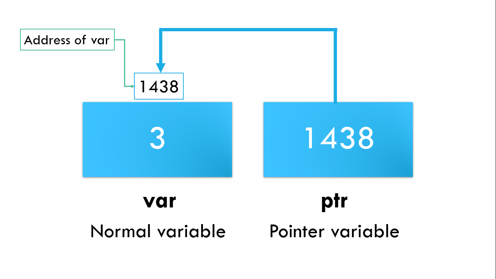

# ⚡Pointers in C++

## Pointers

## 

- A pointer however, is a variable that stores the memory address/reference of another variable as its value.
- Pointers are symbolic representation of addresses.
- A pointer variable points to a data type of the same type, and is created with the \* operator.
- Example:

```cpp
  int num = 8;
  int *ptr; // ptr is a pointer variable
  ptr = &num // stores address of variable num in pointer ptr
```

## Address of operator (&)

- Output the memory address of variable.
- Example:

```cpp
  int a = 3;
  std::cout << &a; //displays 0x6dfed4
```

## Dereference operator (\*)

- Output the value stored in memory address.
- Example:

```cpp
  int a = 3;
  int *ptr = &a; //ptr stores address of variable a
  std::cout << *ptr; // displays 3
```
