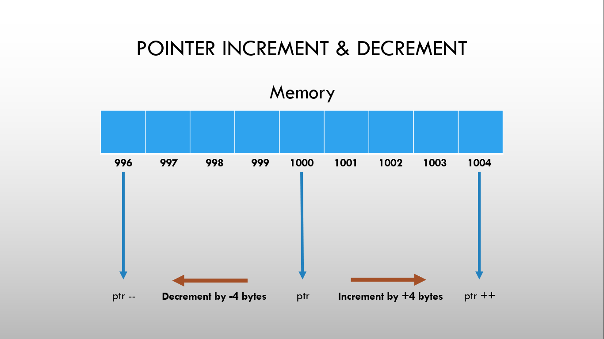
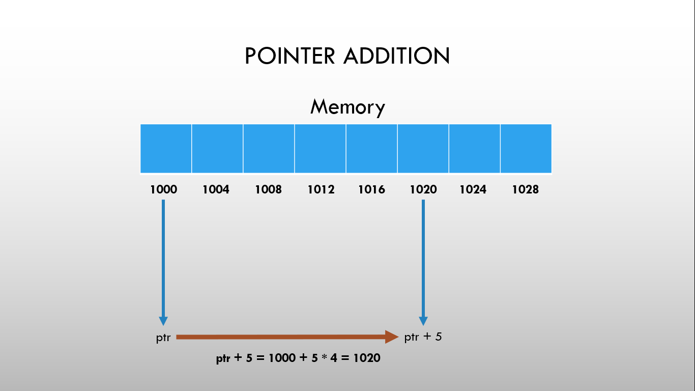
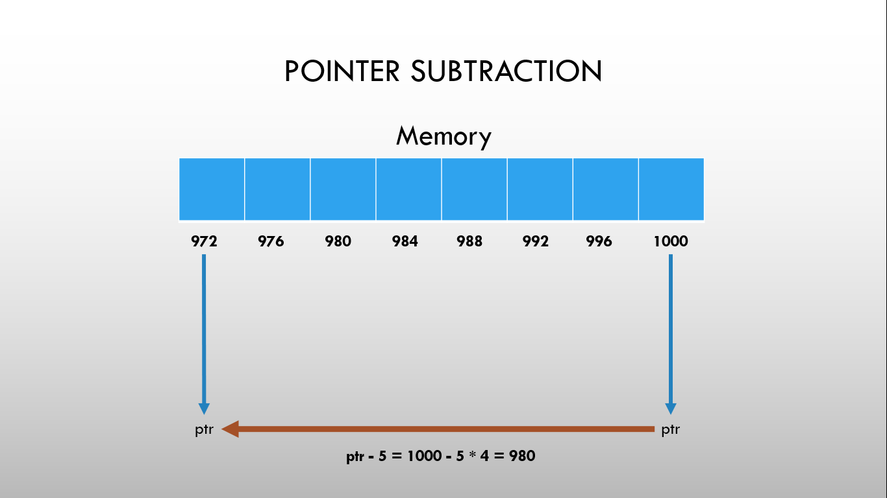

# ⚡Pointer Arithmetics

## Pointer Arithmetics

- Pointer Arithmetic is the set of valid arithmetic operations that can be performed on pointers.
- Hence, there are only a few operations that are allowed to perform on Pointers in C++.
- They are:
  - Increment/Decrement of a Pointer
  - Addition of Integer to Pointer
  - Subtraction of Integer to Pointer
  - Subtraction of Two Pointers
  - Comparison of pointers of the same type

## Increment/Decrement of a Pointer

### 

- When a pointer is incremented, it actually increments by the number equal to the size of the data type for which it is a pointer.  
- > For Example: If an integer pointer that stores address 1000 is incremented, then it will increment by 4(size of an int), and the new address will point to 1004.
- When a pointer is decremented, it actually decrements by the number equal to the size of the data type for which it is a pointer.  
- > For Example: If an integer pointer that stores address 1000 is decremented, then it will decrement by 4(size of an int), and the new address will point to 996.

## Addition of Integer to Pointer

### 

- When a pointer is added with an integer value, the value is first multiplied by the size of the data type and then added to the pointer.  
- > For Example: Consider the ptr is an integer pointer that stores 1000 as an address. If we add integer 5 to it using the expression, ptr = ptr + 5, then, the final address stored in the ptr will be ptr = 1000 + sizeof(int) \* 5 = 1020.

## Subtraction of Integer to Pointer

### 

- When a pointer is subtracted with an integer value, the value is first multiplied by the size of the data type and then subtracted from the pointer similar to an addition.  
- > For Example: Consider the ptr is an integer pointer that stores 1000 as an address. If we subtract integer 5 from it using the expression, ptr = ptr – 5, then, the final address stored in the ptr will be ptr = 1000 – sizeof(int) \* 5 = 980.

## Subtraction of Two Pointers

- The subtraction of two pointers is possible only when they have the same data type.
- The subtraction of two pointers gives the increments between the two pointers.  
- > For Example: Two integer pointers say ptr1(address:1000) and ptr2(address:1004) are subtracted. The difference between addresses is 4 bytes. Since the size of int is 4 bytes, therefore the increment between ptr1 and ptr2 is given by (4/4) = 1.

## Comparison of pointers of the same type

- We can compare the two pointers by using the comparison operators in C++.
- We can implement this by using all operators in C >, >=, <, <=, ==, !=.
- It returns true for the valid condition and returns false for the unsatisfied condition.
