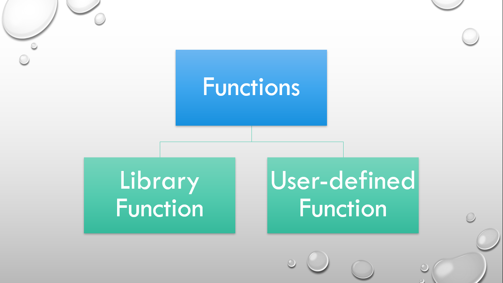

# ⚡Functions in C++

## Functions

### 

A function is a block of code which only runs when it is called. We can pass data, known as parameters, into a function. Functions are used to perform certain actions, and they are important for reusing code: Define the code once, and using it many times.

## Types

- Library function
- User-defined function

## Return types

A return is a value that a function returns to the calling script or function when it completes its task. They can be int, float, char, string, void etc. Based on the return type, they are of four types:

- without return without arguments
- without return with arguments
- with return without arguments
- with return with arguments

## Creating a function

- Functions includes prototype, definition and function calling.
- Prototype describes the type of function and arguments to be passed.
- Defintion describes the block of statements to be executed by function.
- Function calling includes calling the particular function to make task done.

#### Syntax:

```cpp
  //Function prototype
  return_type function_name (parameter1,..., parameterN);
  //Function calling
  function_name(parameter1,..., parameterN);
  //Function definition
  return_type function_name (parameter1,..., parameterN)
  {
    //block of statements
  }
```

#### Example:

```cpp
    //function prototype
    void sum(int, int);
    int main()
    {
      //function calling
      sum(3, 21);
      return 0;
    }
    //function definition
    void sum(int a, int b)
    {
      int sum = a + b;
      printf("Sum: %d", sum);
    }
```
