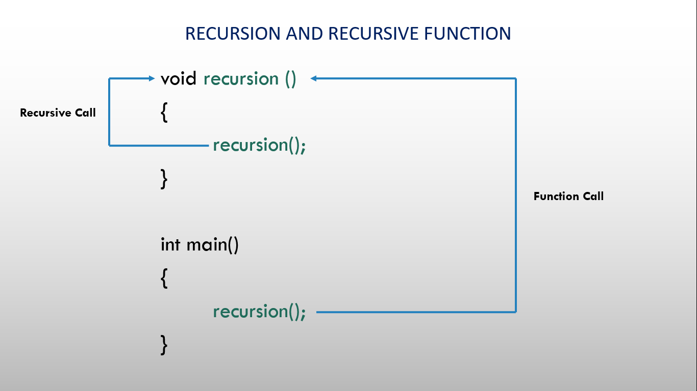

# ⚡Recursion and Recursive function

## Recursion and Recursive function

### 

- A function that calls itself is known as a recursive function. And, this technique is known as recursion.
- It uses the method of dividing the program into sub-tasks and calling it repeatedly instead of the iterative method which takes lots of time to solve the same problem.
- As the recursive function calls itself continuously, it is always possible that the program goes into an infinite loop.
- So, the most important thing about the recursion is it should have the base case to terminate the recursion.

## Syntax:

Below is the working of recursion in C++:

```cpp
  void recursion()
  {
    recursion();
  }

  int main()
  {
    recursion();
  }
```

## Questions

1. Fibonacci Series Using Recursion in C++.
2. Fibonacci Series Using Recursion in C++.
3. Calculate Number Power Using Recursion.

## Programs

```cpp
// 1. Fibonacci Series Using Recursion in C++.

#include <iostream>
using namespace std;

int fibonnaci(int);

int main()
{
  int n, i = 0;
  cout << "Number of terms? ";
  cin >> n;
  cout << "\nFibonnaci Series : ";
  while (i < n)
  {
    cout << " " << fibonnaci(i);
    i++;
  }
  return 0;
}

int fibonnaci(int n)
{
  if ((n == 1) || (n == 0))
    return (n);
  else
    return (fibonnaci(n - 1) + fibonnaci(n - 2));
}
```

```cpp
// 2. Fibonacci Series Using Recursion in C++.

#include <iostream>
using namespace std;

int fact(int n);

int main()
{
  int n;
  cout << "Number? ";
  cin >> n;
  cout << "Factorial of " << n << " = " << fact(n);
  return 0;
}

int fact(int n)
{
  if (n > 1)
    return n * fact(n - 1);
  else
    return 1;
}
```

```cpp
// 3. Calculate Number Power Using Recursion.

#include <iostream>
using namespace std;

int calculate(int, int);

int main()
{
  int base, power, result;
  cout << "Base? ";
  cin >> base;
  cout << "Power? ";
  cin >> power;
  result = calculate(base, power);
  cout << base << "^" << power << " = " << result;
  return 0;
}

int calculate(int base, int power)
{
  if (power != 0)
    return (base * calculate(base, power - 1));
  else
    return 1;
}
```
