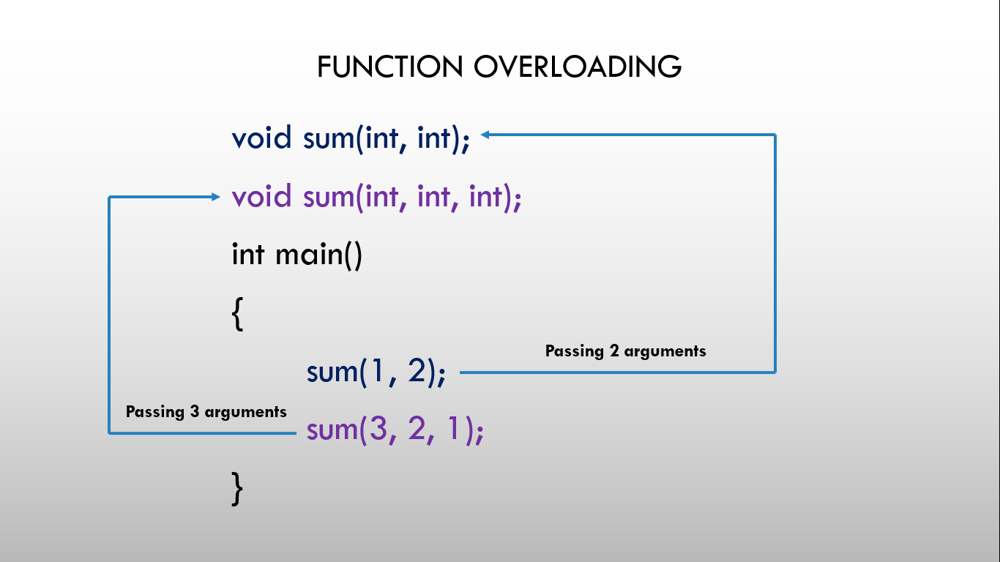

# ⚡Function Overloading in C++

## Function overloading

### 

- Function overloading is a feature of object-oriented programming where two or more functions can have the same name but different parameters.
- When a function name is overloaded with different jobs it is called Function Overloading.
- In Function Overloading “Function” name should be the same and the arguments should be different.
- Function overloading can be considered as an example of a polymorphism feature in C++.

## Example

```cpp
add(int a, int b)
add(int a, int b, int c)
```

Here, the function add() is overloaded function, one with 2 arguments and another with 3 arguments. So, when the add() function is called with 2 arguments, the function add(int a, int b) is executed and when the add() function is called with 3 arguments, the function add(int a, int b, int c) is executed.

## Program

```cpp
#include <iostream>
using namespace std;

// overloaded function
int sum(int, int);
int sum(int, int, int);

int main()
{
  cout << "Passing 1 and 2 arguments: " << sum(1, 2) << endl;
  cout << "Passing 1, 2, and 3 arguments: " << sum(1, 2, 3);
  return 0;
}

int sum(int a, int b)
{
  return a + b;
}

int sum(int a, int b, int c)
{
  return a + b + c;
}
```
