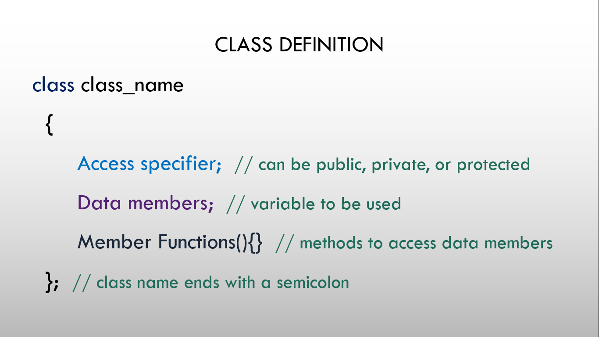

# ⚡Class definiton and Object defintion in C++

## Class

### 

- When we define a class, we define a blueprint for a data type.
- This doesn't actually define any data, but it does define what the class name means, that is, what an object of the class will consist of and what operations can be performed on such an object.
- A class definition starts with the keyword 'class' followed by the 'class name' and the 'class body', enclosed by a pair of curly braces.
- A class definition must be followed either by a semicolon or a list of declarations.

#### Syntax

```cpp
  class class_name
  {
    Access specifier:
    Data members;
    Member functions(){}
  };
```

## Object

- A class provides the blueprints for objects, so basically an object is created from a class.
- We declare objects of a class with exactly the same sort of declaration that
  we declare variables of basic types.

#### Syntax

```cpp
  class_name object_name;
```

## Data Member of Class

- Data members are the variables inside the class.
- These date members are access by object of class from outside the class.
- Data member can be any data type like int, float, char, double etc.

#### Syntax

```cpp
  class Demo
  {
    int member1;
    float member2;
    char member3;
  };
```

## Program

```cpp
// Program to define a Class and creating an Object

#include <iostream>
using namespace std;

// Class definition
class Student
{
  // data members
  string name;
  string faculty;
  string sex;
};

int main()
{
  // creating object Vidhya
  Student Vidhya;
  return 0;
}

```
