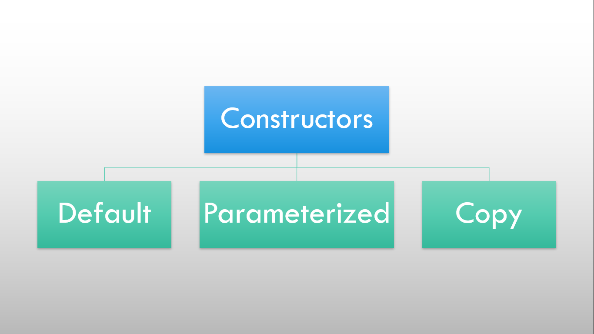

# ⚡Types of Class Constructors

### 

There are mainly three types of Class Constructors in C++ i.e. Default Constructor, Parameterized Constructor and Copy Constructor.

## Default Constructor

- The constructor which does not take any arguments is called default constructor.
- It is also called a non-parameterized constructor.
- The compiler automatically creates a default constructor without data member or initialization if no constructor is explicitly declared.

#### Example

```cpp
// Program to demonstrate default constructor

#include <iostream>
using namespace std;

class Complex
{
  int real, imag;

public:
  Complex() // default constructor
  {
    real = 0;
    imag = 0;
  }

  void showNumber()
  {
    cout << "Complex number is " << real << "+" << imag << "i" << endl;
  }
};

int main()
{
  Complex c;
  c.showNumber();
  return 0;
}
```

## Parameterized Constructor

- It takes argument while calling the constructor.
- Typically these arguments are used to initialize an object when it is created.

#### Example

```cpp
// Program to demonstrate parameterized constructor

#include <iostream>
using namespace std;

class Complex
{
  int real, imag;

public:
  Complex(int a, int b) // parameterized constructor
  {
    real = a;
    imag = b;
  }

  void showNumber()
  {
    cout << "Complex number is " << real << "+" << imag << "i" << endl;
  }
};

int main()
{
  // implicit invoke
  Complex c1(8, 7);
  c1.showNumber();

  // explicit invoke
  Complex c2 = Complex(3, 21);
  c2.showNumber();

  return 0;
}
```

## Copy Constructor

- The copy constructor is a constructor which creates an object by initializing it with an object of the same class, which has been created previously.
- The copy constructor is used to
  - Initialize one object from another of the same type.
  - Copy an object to pass it as an argument to a function.
  - Copy an object to return it from a function.

#### Example

```cpp
// Program to demonstrate copy constructor

#include <iostream>
using namespace std;

class Complex
{
  int real, imag;

public:
  Complex(int a, int b)
  {
    real = a;
    imag = b;
  }

  Complex(Complex &c) // copy constructor
  {
    real = c.real;
    imag = c.imag;
  }

  void showNumber()
  {
    cout << "Complex number is " << real << "+" << imag << "i" << endl;
  }
};

int main()
{
  Complex c1(3, 21);
  c1.showNumber();

  Complex c2(c1);
  c2.showNumber();

  return 0;
}
```
