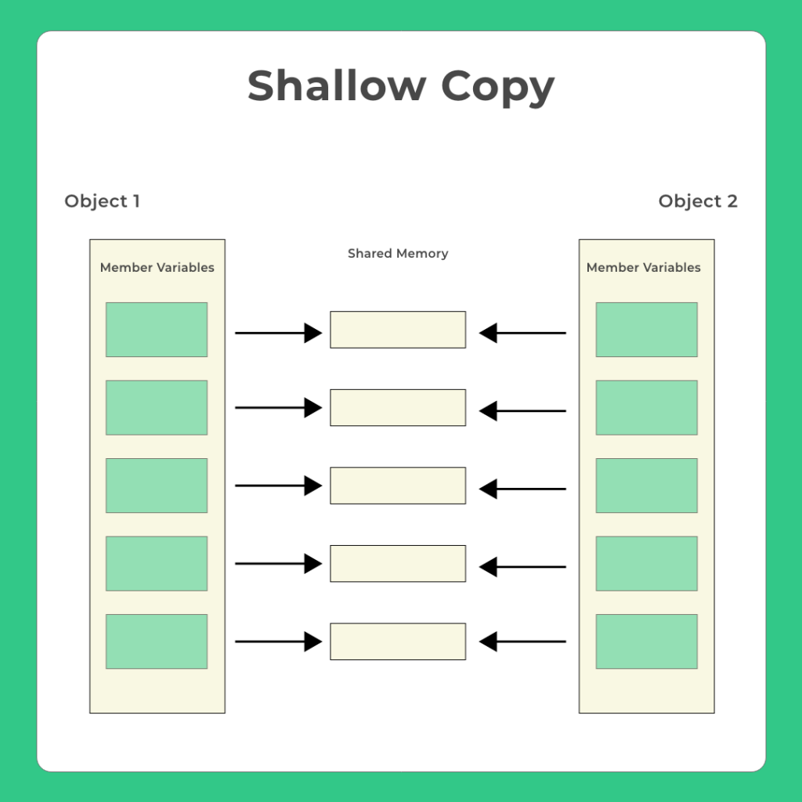
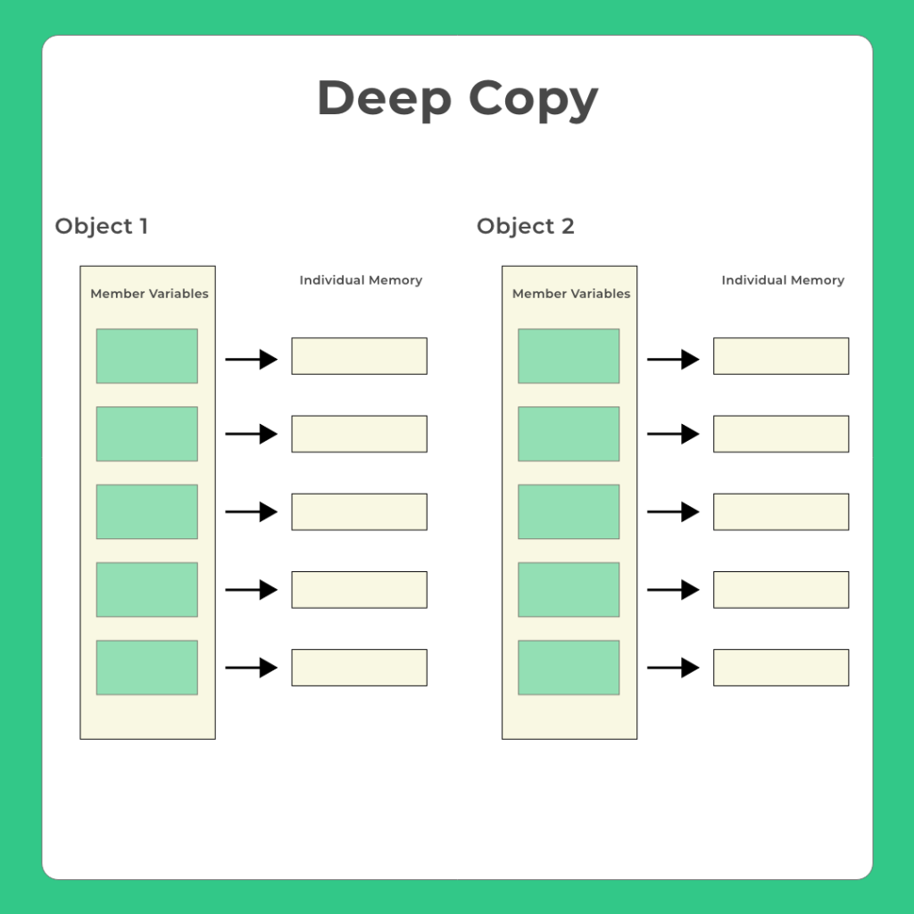

# ⚡Shallow Copying and Deep Copying with Copy Constructor

## Shallow Copying

### 

- Whenever we do not create our own user-defined copy constructor and we do copying, the compiler creates its own hidden copy constructor.
  - Whenever this happens the member variables etc share the same memory locations.
  - For example, if there are two objects (object1 and object2) then, any change in object1 is also reflected in object2.
- This default copy constructor does shallow copy.
- This only happens in heap memory variables i.e. pointers.

### Example

```cpp
// Program to demonstrate shallow copying with copy constructor

#include <iostream>

class ShallowCopy
{
public:
  int data;
  int *ptr;

  ShallowCopy(int d)
  {
    data = d;
    ptr = new int(d);
  }

  // Shallow copy constructor
  ShallowCopy(const ShallowCopy &other)
  {
    data = other.data;
    ptr = other.ptr;
  }

  void Display()
  {
    std::cout << "Data: " << data << ", Int: " << *ptr << std::endl;
  }
};

int main()
{
  // Shallow copy example
  ShallowCopy obj1(1);
  ShallowCopy obj2 = obj1; // Shallow copy

  obj1.Display();
  obj2.Display();

  // Modify obj2
  obj2.data = 2;
  *obj2.ptr = 3;

  obj1.Display();
  obj2.Display(); // Both objects share the same int pointer, so modifying one affects the other

  return 0;
}

```

```
Output:
Data: 1, Int: 1
Data: 1, Int: 1
Data: 1, Int: 3
Data: 2, Int: 3
```

## Deep Copying

### 

- Whenever we create our own user-defined copy constructor and we do the copying.
  - Whenever this happens the member variables for any objects have their own memory locations.
  - For example, if there are two objects (object1 and object2) then, any change in object1 is not reflected in object2.
- User-defined copy constructor do a deep copy.
- In user defined copy constructor, we make sure that
  pointers (or references) of copied object points to new memory locations.
- This only happens in heap memory variables i.e. pointers.

```cpp
// Program to demonstrate deep copying with copy constructor

#include <iostream>

class DeepCopy
{
public:
  int data;
  int *ptr;

  DeepCopy(int d)
  {
    data = d;
    ptr = new int(d);
  }

  // Deep copy constructor
  DeepCopy(const DeepCopy &other)
  {
    data = other.data;
    ptr = new int;
    *ptr = *(other.ptr);
  }

  void Display()
  {
    std::cout << "Data: " << data << ", Int: " << *ptr << std::endl;
  }
};

int main()
{

  // Deep copy example
  DeepCopy obj1(1);
  DeepCopy obj2 = obj1; // Deep copy

  obj1.Display();
  obj2.Display();

  // Modify obj2
  obj2.data = 2;
  *obj2.ptr = 3;

  obj1.Display();
  obj2.Display(); // Each object has its own separate int, so they don't affect each other

  return 0;
}

```

```
Output:
Data: 1, Int: 1
Data: 1, Int: 1
Data: 1, Int: 1
Data: 2, Int: 3
```
