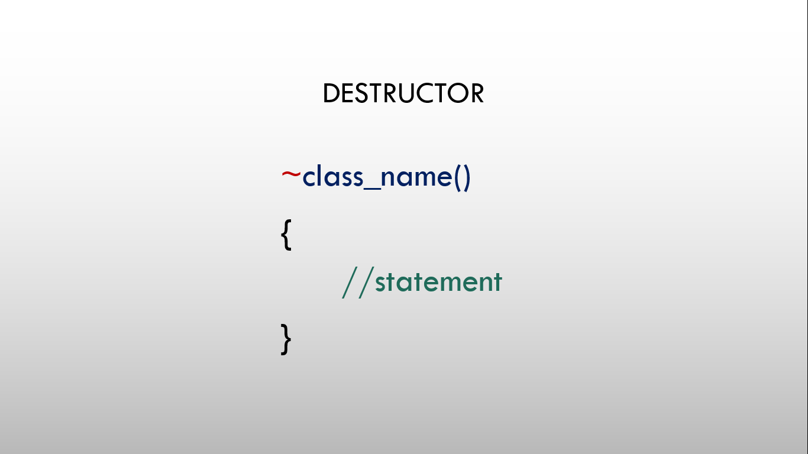

# ⚡Destructors in C++

## Destructor

### 

- A Destructor is a special member function of a class which is executed whenever an object of that class goes out of scope.
- Destructor is created using tilde(~) sign.
- Destructor is created automatically by the compiler and invoked automatically when an object of the class goes out of scope.
- Destructor is used in order to free up the memory or release the memory used by the class objects.

#### Syntax

```cpp
  ~classname()
  {
    //statement
  }
```

## Program

```cpp
// Program to demonstrate destructor

#include <iostream>
using namespace std;

class Complex
{
  int real, imag;

public:
  Complex(int a, int b)
  {
    real = a;
    imag = b;
  }

  void showData()
  {
    cout << "Complex number is " << real << "+" << imag << "i" << endl;
  }

  // destructor definition
  ~Complex()
  {
    cout << "Destructor is called..." << endl;
  }
};

int main()
{
  Complex c1(8, 7);
  c1.showData();
  Complex c2(8, 7);
  c2.showData();
  return 0;
}

/*
output:
8+7i
8+7i
Destructor is called...
Destructor is called...
*/
```
