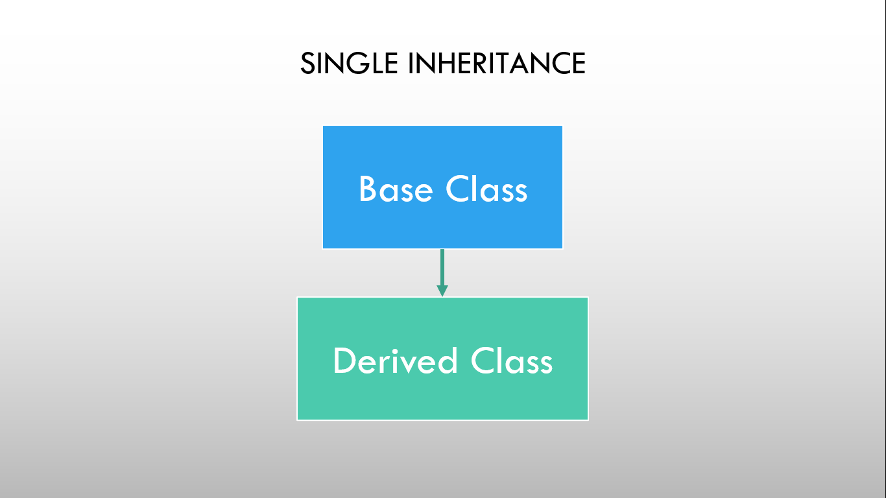
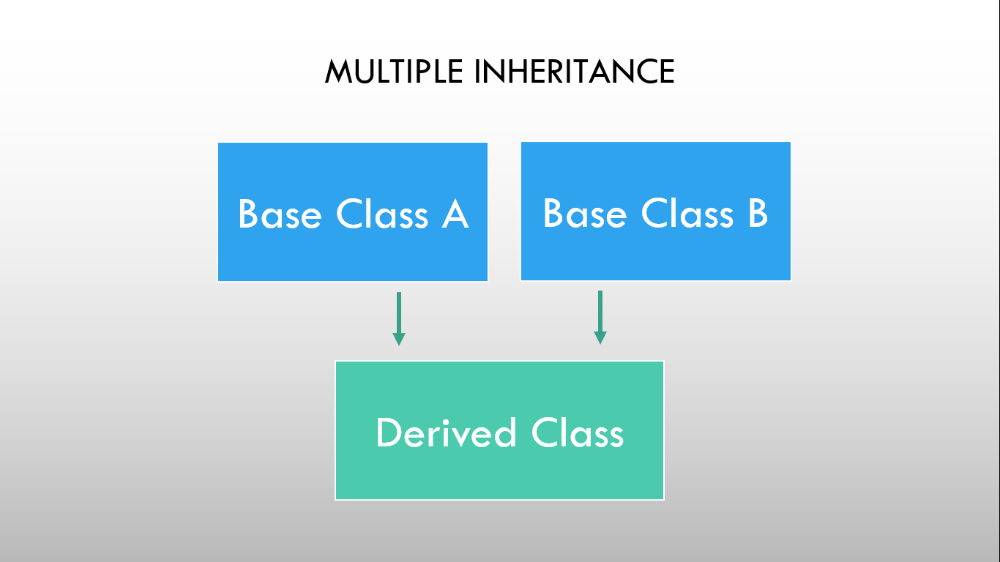
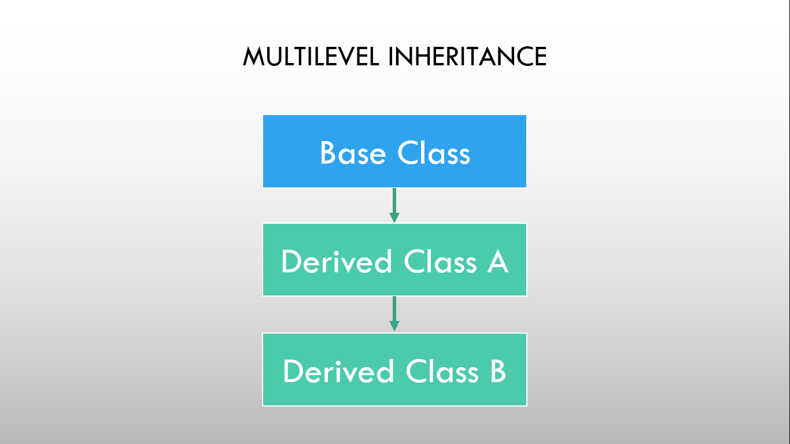
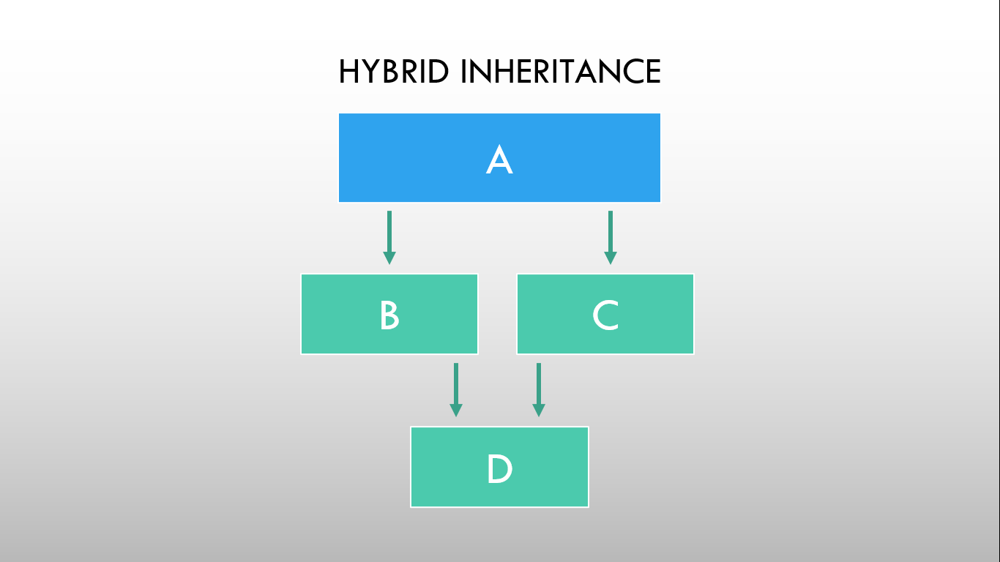

# ⚡Introduction to Inheritance

## Inheritance

- Inheritance is a feature of OOPs in which new classes are created from the existing classes.
- The new class created is called "derived class" or "child class" and the existing class is known as the "base class" or "parent class".
- The derived class now is said to be inherited from the base class. It means, the derived class inherits all the properties of the base class, without changing the properties of base class and may add new features to its own.
- These new features in the derived class will not affect the base class.
- The derived class is the specialized class for the base class.

### Super Class

The class whose properties are inherited by a subclass is called Base Class or Superclass.

### Sub Class

The class that inherits properties from another class is called Subclass or Derived Class.

## Features of Inheritance

- Code Reusability: Inheritance allows you to reuse existing code, reducing redundancy and development time.
- Hierarchy: It helps create a clear hierarchy of classes, making code organization and maintenance easier.
- Extensibility: You can extend the functionality of existing classes without modifying their code.
- Modularity: Encourages modularity in code design by breaking it into smaller, manageable pieces (classes).
- Code Maintenance: Simplifies code maintenance as changes made in the base class are automatically reflected in derived classes.
- Specialization: Allows for creating specialized classes with specific features while inheriting common functionality.

## Types of Inheritance

- Single Inheritance
- Multiple Inheritance
- Hierarchical Inheritance
- Multilevel Inheritance
- Hybrid Inheritance

### Single Inheritance

### 

- Single inheritance is a type of inheritance in which a derived class is inherited with only one base class.

### Multiple Inheritance

### 

- Multiple inheritance are a type of inheritance in which one derived class is inherited with more than one base class.

### Hierarchical Inheritance

### 

- A hierarchical inheritance is a type of inheritance in which several derived classes are inherited from a single base class.

### Multilevel Inheritance

### 

- Multilevel inheritance is a type of inheritance in which one derived class is inherited from another derived class.

### Hybrid Inheritance

### 

- Hybrid inheritance is a combination of multiple inheritance and multilevel inheritance.
- In hybrid inheritance, a class is derived from two classes as in multiple inheritances.

### ⭐Note: Friend Functions cannot be inherited.
