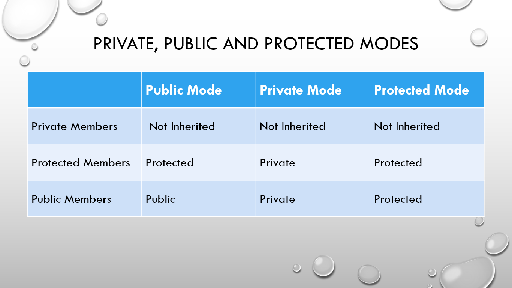

# ⚡Inheritance Syntax and Visibility Modes

## Syntax of Inheritance

```cpp
class derivedClassName:visibilityMode baseClassName,...
{
  //statements
};
```

## Visibility Modes

### 

The various ways we can derive classes are known as visibility modes or access modes.

- Public Visibility Mode: In this mode, Public members of the base class becomes Public members of the derived class.
- Private Visibility Mode: In this mode, Public members of the base class becomes Private members of the derived class.
- Protected Visibility Mode: In this mode, the Public members of the base class become Protected members in the derived class. The Protected Mode often act as Private Mode but the Protected members can be derived whereas Private members cannot be derived.

#### Note:

- By default, the visibility mode is Private.
- Similarly, the Private members of the base class cannot be inherited.

### Examples

```cpp
// Program to demonstrate Private derivation

#include <iostream>
using namespace std;

class employee // base class
{
  int id;       // private
  float salary; // private

public:
  employee() = default;

  employee(int setId)
  {
    id = setId;
    salary = 800;
  }

  void display()
  {
    cout << "Employee ID: " << id << endl;
    cout << "Salary: " << salary << endl;
  }
};

class programmer : employee // derived class
{
public:
  programmer(int setId)
  {
    id = setId; // id cannot be accessed
  }
};

int main()
{
  // statements
  return 0;
}
```

```
Output:
Employee ID: 1
Name: Bishal Baniya
Salary: 800
Experience: 3
```

```cpp
// Program to demonstrate Public derivation

#include <iostream>
using namespace std;

class employee // base class
{
public:
  int id;
  string name;
  float salary;
  int experience;
};

class programmer : public employee // derived class
{

public:
  programmer(int getId, string getName, float getSalary, int getExperience)
  {
    id = getId;
    salary = getSalary;
    name = getName;
    experience = getExperience;
  }

  void display()
  {
    cout << "Employee ID: " << id << endl;
    cout << "Name: " << name << endl;
    cout << "Salary: " << salary << endl;
    cout << "Experience: " << experience << endl;
  }
};

int main()
{
  programmer Rahul(1, "Rahul Das", 800.0f, 3);

  // here, the data members can be directly accessed
  cout << "Employee ID: " << Rahul.id << endl;
  cout << "Name: " << Rahul.name << endl;
  cout << "Salary: " << Rahul.salary << endl;
  cout << "Experience: " << Rahul.experience << endl;
  return 0;
}
```

```
Output:
Employee ID: 1
Name: Rahul Das
Salary: 800
Experience: 3
```

```cpp
// Program to demonstrate Protected derivation

#include <iostream>
using namespace std;

class employee // base class
{

protected:
  int id;
  float salary;

public:
  string name;
  int experience;
};

class programmer : protected employee // derived class
{

public:
  programmer(int getId, string getName, float getSalary, int getExperience)
  {
    id = getId;
    salary = getSalary;
    name = getName;
    experience = getExperience;
  }

  void display()
  {
    cout << "Employee ID: " << id << endl;
    cout << "Name: " << name << endl;
    cout << "Salary: " << salary << endl;
    cout << "Experience: " << experience << endl;
  }
};

int main()
{
  programmer Anubhav(1, "Anubhav Sharma", 800.0f, 3);
  Anubhav.display();
  return 0;
}
```

```
Output:
Employee ID: 1
Name: Anubhav Sharma
Salary: 800
Experience: 3
```
