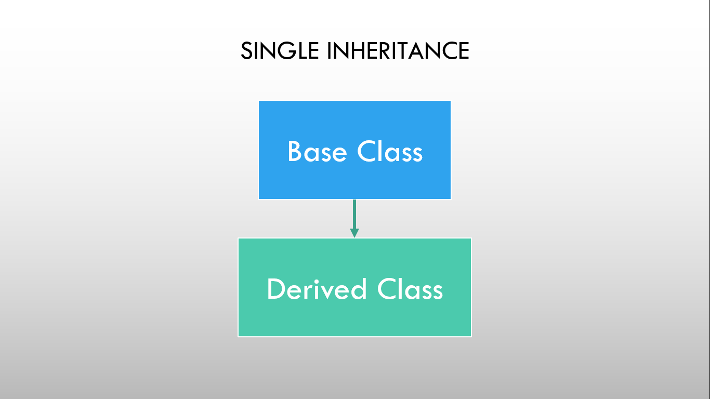

# ⚡Single Level Inheritance

### 

As shown in the figure, in single inheritance, only one class can be derived from the base class. Based on the visibility mode used or access specifier used while deriving, the properties of the base class are derived. Access specifier can be private, protected or public.

### Example

```cpp
// Program to demonstrate Single level inheritance

#include <iostream>
using namespace std;

class base // base class
{
protected:
  int firstNumber, secondNumber;

public:
  void getNumbers()
  {
    cout << "Enter first and second number: ";
    cin >> firstNumber >> secondNumber;
  }
};

class derive : public base // derived class
{
  int product;

public:
  void getProduct()
  {
    product = firstNumber * secondNumber;
    cout << "Product is " << product << endl;
  }
};

int main()
{
  derive d;
  d.getNumbers();
  d.getProduct();
  return 0;
}
```

```
Output:
Enter first and second number: 8 7
Product is 56
```
