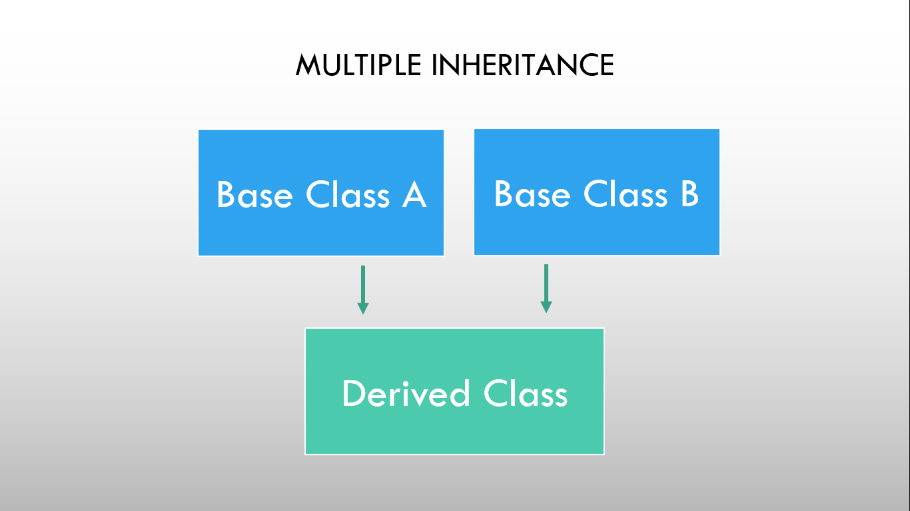

# ⚡Multiple Inheritance

### 

As shown in the figure, in multiple inheritance one derived class is inherited from more than one base class. Based on the visibility mode used or access specifier used while deriving, the properties of the base class are derived. Access specifier can be private, protected or public.

### Example

```cpp
// Program to demonstrate Multiple inheritance

#include <iostream>
using namespace std;

// first base class
class firstPoint
{
protected:
  int xCoordinateF, yCoordinateF;

public:
  void getFirstPoint()
  {
    cout << "Enter x and y coordinate for first point: ";
    cin >> xCoordinateF >> yCoordinateF;
  }
};

// second base class
class second_point
{
protected:
  int xCoordinateS, yCoordinateS;

public:
  void getSecondPoint()
  {
    cout << "Enter x and y coordinate for second point: ";
    cin >> xCoordinateS >> yCoordinateS;
  }
};

// derived class
class totalCoordinate : public firstPoint, public second_point
{
  int xCoordinateSum, yCoordinateSum;

public:
  void getCoordinateSum()
  {
    xCoordinateSum = xCoordinateF + xCoordinateS;
    yCoordinateSum = yCoordinateF + yCoordinateS;
    cout << "Sum of x-coordinates: " << xCoordinateSum << endl;
    cout << "Sum of y-coordinates: " << yCoordinateSum << endl;
  }
};

int main()
{
  totalCoordinate firstLine;
  firstLine.getFirstPoint();
  firstLine.getSecondPoint();
  firstLine.getCoordinateSum();
  return 0;
}
```

```
Output:
Enter x and y coordinate for first point: 3 8
Enter x and y coordinate for second point: 4 -7
Sum of x-coordinates: 7
Sum of y-coordinates: 1
```
