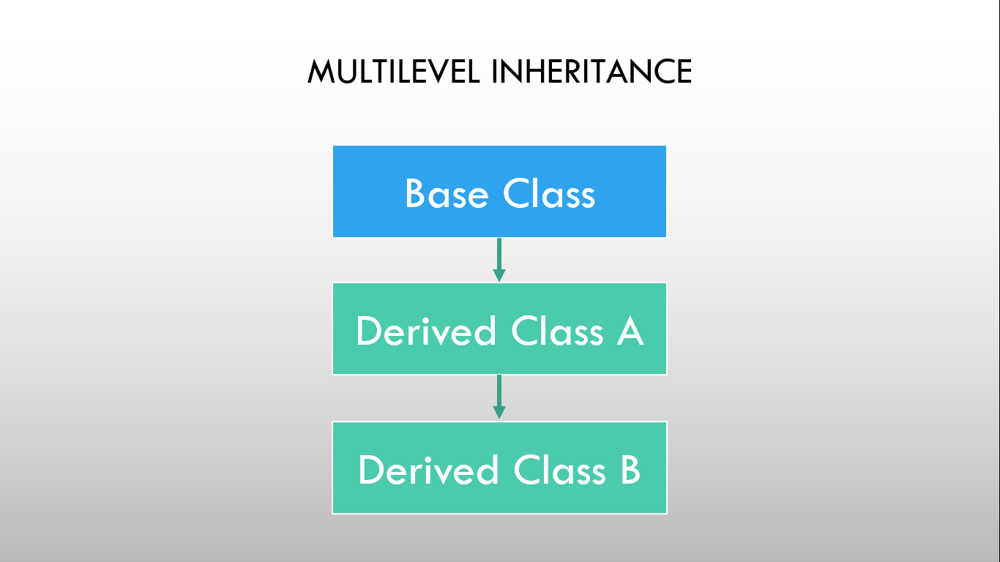

# ⚡Multilevel Inheritance

### 

As shown in the figure, in multilevel inheritance one derived class is inherited from another derived class. Based on the visibility mode used or access specifier used while deriving, the properties of the base class are derived. Access specifier can be private, protected or public.

### Example

```cpp
// Program to demonstrate Multilevel inheritance

#include <iostream>
using namespace std;

// base class
class student
{
protected:
  int id;
  string name;

public:
  void getDetails()
  {
    cout << "Enter student id: ";
    cin >> id;
    cout << "Enter student name: ";
    cin >> name;
  }
};

// first derived class
class subjectMarks : public student
{
protected:
  float physics, maths;

public:
  void setMarks()
  {
    cout << "Enter marks in Physics: ";
    cin >> physics;
    cout << "Enter marks in Maths: ";
    cin >> maths;
  }
};

// second derived class
class result : public subjectMarks
{
  float result;

public:
  void getResult()
  {
    result = physics + maths;
    cout << "Result: " << result << endl;
  }
};

int main()
{
  result Harish;
  Harish.getDetails();
  Harish.setMarks();
  Harish.getResult();
  return 0;
}
```

```
Output:
Enter student id: 1
Enter student name: Bishal_Baniya
Enter marks in Physics: 65
Enter marks in Maths: 60
Result: 125
```
