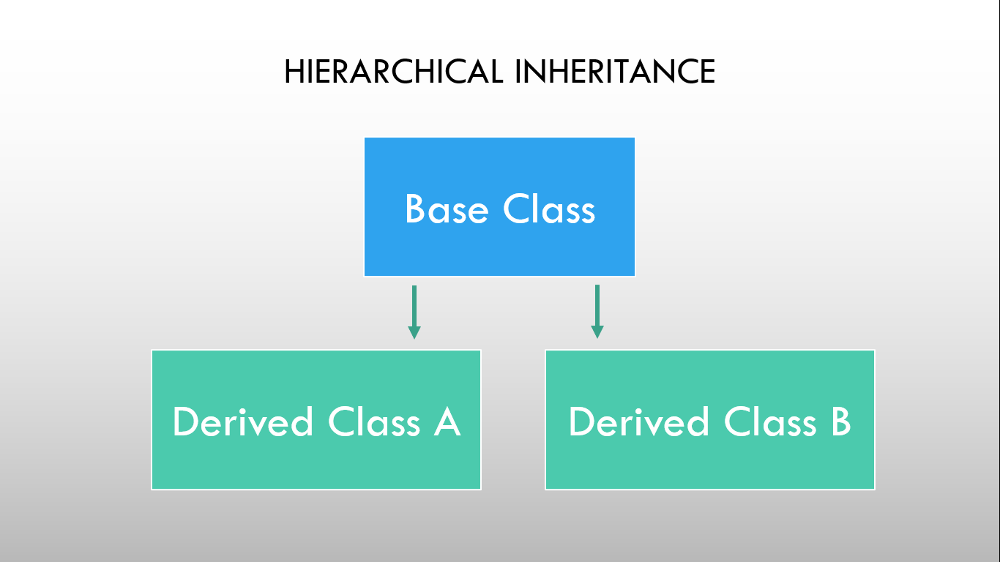

# ⚡Hierarchial Inheritance

### 

As shown in the figure, in hierarchical inheritance several derived classes are inherited from a single base class. Based on the visibility mode used or access specifier used while deriving, the properties of the base class are derived. Access specifier can be private, protected or public.

### Example

```cpp
// Program to demonstrate Hierarchial inheritance

#include <iostream>

// Base class
class Animal
{
public:
  void eat() const
  {
    std::cout << "Animal is eating" << std::endl;
  }
};

// Derived class 1
class Dog : public Animal
{
public:
  void bark() const
  {
    std::cout << "Dog is barking" << std::endl;
  }
};

// Derived class 2
class Cat : public Animal
{
public:
  void meow() const
  {
    std::cout << "Cat is meowing" << std::endl;
  }
};

int main()
{
  Dog myDog;
  Cat myCat;

  myDog.eat();  // Animal is eating
  myDog.bark(); // Dog is barking

  myCat.eat();  // Animal is eating
  myCat.meow(); // Cat is meowing

  return 0;
}
```

```
Output:
Animal is eating
Dog is barking
Animal is eating
Cat is meowing
```
