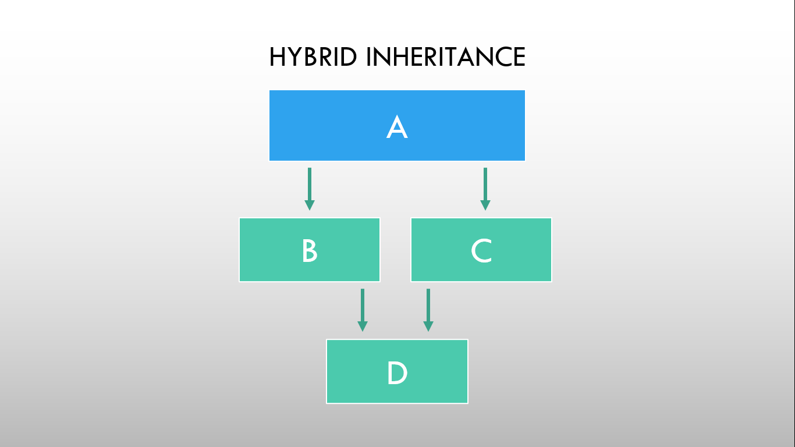

# ⚡Hybrid Inheritance

### 

As shown in the figure, hybrid inheritance is a combination of multiple inheritance and multilevel inheritance. In hybrid inheritance, a class is derived from two classes as in multiple inheritances. Based on the visibility mode used or access specifier used while deriving, the properties of the base class are derived. Access specifier can be private, protected or public.

### Example

```cpp
// Program to demonstrate Hybrid inheritance

#include <iostream>
using namespace std;

class Student
{
protected:
  int id;
  string name;

public:
  void getStudentDetails()
  {
    cout << "Student ID: ";
    cin >> id;
    cout << "Student Name: ";
    cin >> name;
  }
};

class Theory : public Student
{
protected:
  float physics, maths;

public:
  void getTheoryMarks()
  {
    cout << "Enter marks in Physics and Maths: ";
    cin >> physics >> maths;
  }
};

class Practical
{
protected:
  float practicalMarks;

public:
  void getPracticalMarks()
  {
    cout << "Enter practical marks: ";
    cin >> practicalMarks;
  }
};

class Result : public Theory, public Practical
{
  float total;

public:
  void getResult()
  {
    total = physics + maths + practicalMarks;
    cout << "Student ID: " << id << endl;
    cout << "Student Name: " << name << endl;
    cout << "Total Marks: " << total << endl;
  }
};

int main()
{
  Result Bishal;
  Bishal.getStudentDetails();
  Bishal.getTheoryMarks();
  Bishal.getPracticalMarks();
  Bishal.getResult();
  return 0;
}
```

```
Output:
Student Name: Bishal_Baniya
Enter marks in Physics and Maths: 55 66
Enter practical marks: 25
Student ID: 1
Student Name: Bishal_Baniya
Total Marks: 146
```
