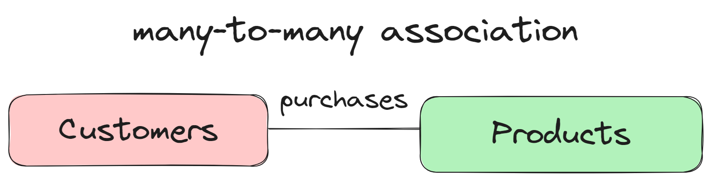

# ⚡Association, Composition and Aggregation

Association, Composition and Aggregation, these three terms describe the different relationships between classes.

## Association

### 

- It is a relationship between two separate classes which is established through their objects.
- Association can be one-to-one, one-to-many, many-to-one, and many-to-many.
- In OOPs, an object communicates with other object to use functionality and services provided by that object.
- Association is known as a `HAS-A` relationship
- Composition and Aggregation are two forms of association.

### One-to-One Association

### 

- In one-to-one association, only one object is associated with other object at a time.
- The multiplicity symbol `|` is written at the end of the link to represent that there is only one object present in communication.
- A line without multiplicity also indicates one-to-one association.

### One-to-Many Association

### 

- In one-to-many association, one object is associated with one or more than one objects at a time.

### Many-to-One Association

### 

- In many-to-one association, multiple objects are associated with one object at a time.

### Many-to-Many Association

### 

- In many-to-many association, many objects are associated with one or more objects at a time.

## Composition

### 

- Composition is a specialized form of aggregation.
- In composition, child objects does not have their lifecycle i.e. if parent object is deleted, then all the child object will also be deleted.
- Composition is as stronger relationship because
  - Composed object becomes a part of composer.
  - Composed object cannot exists independently.

### Example

```cpp
//composition example

#include <iostream>

class Engine // child
{
public:
  int power;
};

class Car // parent
{
public:
  Engine e; // class Engine object as a member variable of class Car
  std::string company;
  std::string color;
  void showDetails()
  {
    std::cout << "Company: " << company << std::endl;
    std::cout << "Color: " << color << std::endl;
    std::cout << "Engine horse power: " << e.power << std::endl;
  }
};

int main()
{
  Car c;
  c.company = "BMW";
  c.color = "Black";
  c.e.power = 550;
  c.showDetails();
  return 0;
}
```

```
Output:
Company: BMW
Color: Black
Engine horse power: 550
```

Here, class `Car` and class `Engine` are having "has a" relationship i.e. "`Car` has a `Engine`". And life of class `Engine` depends on class `Car`. So, if we delete class `Car`, then class `Engine` cannot exists independently and hence class `Engine` will also be deleted.

## Aggregation

### 

- Aggregation is a specialized form of association where all objects have their own life cycle, but there is ownership and a child object cannot belong to another parent object.
- Aggregation is weaker relationship because
  - Aggregate object is not a part of the container and it can exists independently.
- In C++, aggregation is a process in which one class defines another class as any entity reference.
- It is another way to reuse the class.
- It is a form of association that represents `HAS-A` relationship.

### Example

```cpp
// aggregation example

#include <iostream>
#include <string>

class Address
{
private:
  std::string city;

public:
  Address(const std::string &city)
      : city(city) {}

  void displayAddress() const
  {
    std::cout << city << std::endl;
  }
};

class Person
{
private:
  std::string name;
  Address address;

public:
  Person(const std::string &name, const Address &address)
      : name(name), address(address) {}

  void displayInfo() const
  {
    std::cout << "Name: " << name << std::endl;
    std::cout << "City: ";
    address.displayAddress();
  }
};

int main()
{
  Address johnsAddress("Anytown");

  Person john("John Doe", johnsAddress);

  john.displayInfo();

  return 0;
}
```

```
Example:
Name: John Doe
City: Anytown
```

The `Person` class aggregates the `Address` class, indicating that a person has an address. The `Address` class can exist independently, and multiple `Person` objects can share the same `Address` object.
