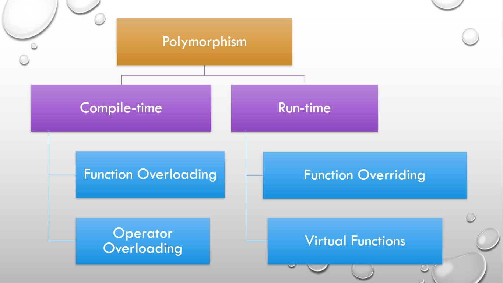

# ⚡Polymorphism

### 

Polymorphism is an important concept in object-oriented programming. It means “more than one form” — the same entity (function or operator) can operate differently under different situations.

There are two types of polymorphism in C++:

- Compile-time polymorphism: This is also called static (or early) binding.
- Runtime polymorphism: This is also called dynamic (or late) binding.

## Compile-time, Static or Early Binding or Static Linking Polymorphism

- Compile-time Polymorphism includes
  - Function/Method Overloading
  - Operator Overloading
- For example, there are two functions with the same name, sum(), but a different number of arguments. The number of parameters passed during function invocation (function calling) determines which function to be called. This is why it is considered as an example of polymorphism because the output is different in different conditions. Since the call is determined during compile time, it is called compile-time polymorphism.

### Example

```cpp
// Program to demonstrate compile-time polymorphism

#include <iostream>
using namespace std;

class Add
{
public:
  // sum() with 2 parameters
  int sum(int num1, int num2)
  {
    return num1 + num2;
  }

  // sum() with 3 parameters
  int sum(int num1, int num2, int num3)
  {
    return num1 + num2 + num3;
  }
};

int main()
{
  Add obj;

  // This will call the first variant of the sum() function
  cout << "Output: " << obj.sum(10, 20) << endl;

  // This will call the second variant of the sum() function
  cout << "Output: " << obj.sum(11, 22, 33) << endl;

  return 0;
}
```

```
Output:
Output: 30
Output: 66
```

## Run-time, Dynamic or Late Binding Polymorphism

- Run-time Polymorphism includes
  - Function Overriding
  - Virtual Functions
- In the case of function overriding, there are two definitions of the same function, one in the parent class and one in the child class. Since the call to the function is determined at runtime to decide which definition of the function is to be called, it is called runtime polymorphism.

### Example

```cpp
// Program to demonstrate run-time polymorphism

#include <iostream>
using namespace std;

class A
{
public:
  void print()
  {
    cout << "Parent Class Function" << endl;
  }
};

class B : public A
{
public:
  void print()
  {
    cout << "Child Class Function" << endl;
  }
};

int main()
{
  // Parent class object
  A obj1;
  obj1.print();

  // Child class object
  B obj2;
  obj2.print();

  return 0;
}
```

```
Output:
Parent Class Function
Child Class Function
```
