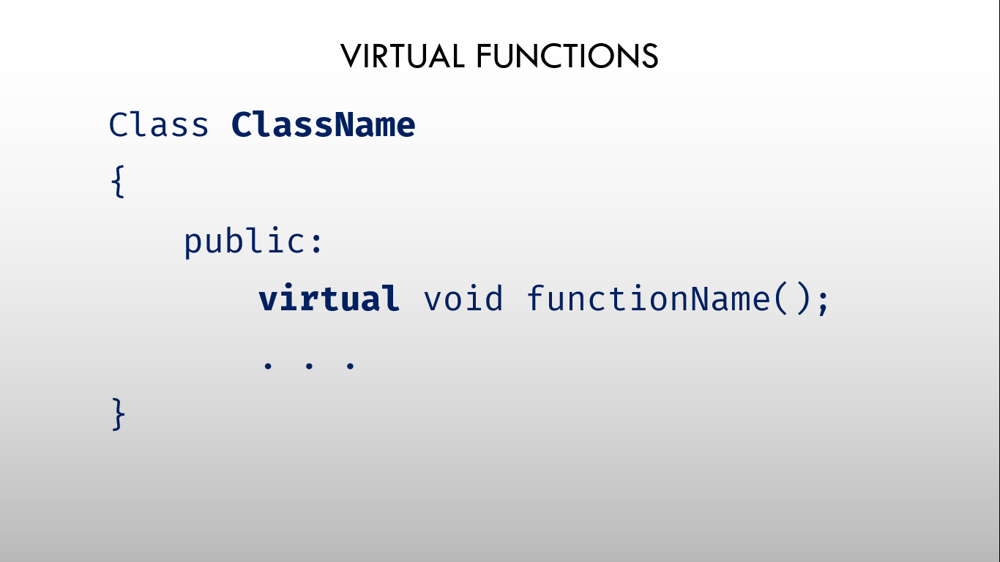
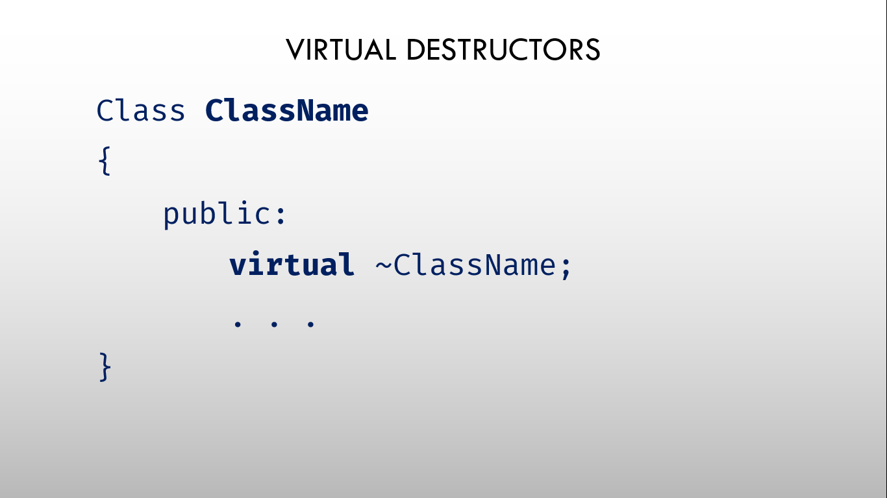

# ⚡Virtual Functions and Virtual Destructors

## Virtual Functions

### 

- A virtual function (also known as virtual methods) is a member function that is declared within a base class and is re-defined (overridden) by a derived class.
- When we refer to a derived class object using a pointer or a reference to the base class, we can call a virtual function for that object and execute the derived class’s version of the method.
- Virtual functions ensure that the correct function is called for an object, regardless of the type of reference (or pointer) used for the function call.
- They are mainly used to achieve Runtime polymorphism.
- Functions are declared with a virtual keyword in a base class.
- The resolving of a function call is done at runtime.
- It allows us to treat all objects generally as objects of the Base class.

## Rules for Virtual Functions

- Virtual functions cannot be static.
- A virtual function can be a friend function of another class.
- Virtual functions should be accessed using a pointer or reference of base class type to achieve runtime polymorphism.
- The prototype of virtual functions should be the same in the base as well as the derived class.
- They are always defined in the base class and overridden in a derived class. It is not mandatory for the derived class to override (or re-define the virtual function), in that case, the base class version of the function is used.
- A class may have a virtual destructor but it cannot have a virtual constructor.

### Examples

```cpp
// without using virtual function

#include <iostream>
using namespace std;

class Account
{
public:
  void withdraw()
  {
    cout << "In Account::withdraw" << endl;
  }
};

class Checking : public Account
{
public:
  void withdraw()
  {
    cout << "In Checking::withdraw" << endl;
  }
};

class Saving : public Account
{
public:
  void withdraw()
  {
    cout << "In Saving::withdraw" << endl;
  }
};

int main()
{
  Account *p1 = new Account();
  Account *p2 = new Checking();
  Account *p3 = new Saving();

  p1->withdraw(); // Account::withdraw
  p2->withdraw(); // Account::withdraw
  p3->withdraw(); // Account::withdraw

  delete p1;
  delete p2;
  delete p3;

  return 0;
}
```

```
Output:
In Account::withdraw
In Account::withdraw
In Account::withdraw
```

```cpp
// with using virtual function

#include <iostream>
using namespace std;

class Account
{
public:
  virtual void withdraw()
  {
    cout << "In Account::withdraw" << endl;
  }
};

class Checking : public Account
{
public:
  virtual void withdraw()
  {
    cout << "In Checking::withdraw" << endl;
  }
};

class Saving : public Account
{
public:
  virtual void withdraw()
  {
    cout << "In Saving::withdraw" << endl;
  }
};

int main()
{
  Account *p1 = new Account();
  Account *p2 = new Checking();
  Account *p3 = new Saving();

  p1->withdraw(); // Account::withdraw
  p2->withdraw(); // Checking::withdraw
  p3->withdraw(); // Saving::withdraw

  delete p1;
  delete p2;
  delete p3;

  return 0;
}
```

```
Output:
In Account::withdraw
In Checking::withdraw
In Saving::withdraw
```

## Virtual Destructors

### 

- Deleting a derived class object using a pointer of base class type that has a non-virtual destructor results in undefined behavior.
- To correct this situation, the base class should be defined with a virtual destructor.
- Making base class destructor virtual guarantees that the object of derived class is destructed properly, i.e., both base class and derived class destructors are called.
- Compared to virtual destructors, there is no existence of such virtual constructors.

### Example

```cpp
// without using virtual destructor

#include <iostream>
using namespace std;

class Account
{
public:
  virtual void withdraw()
  {
    cout << "In Account::withdraw" << endl;
  }

  ~Account()
  {
    cout << "~Account called..." << endl;
  }
};

class Checking : public Account
{
public:
  virtual void withdraw()
  {
    cout << "In Checking::withdraw" << endl;
  }

  ~Checking()
  {
    cout << "~Checking called..." << endl;
  }
};

class Saving : public Account
{
public:
  virtual void withdraw()
  {
    cout << "In Saving::withdraw" << endl;
  }

  ~Saving()
  {
    cout << "~Saving called..." << endl;
  }
};

int main()
{
  Account *p1 = new Account();
  Account *p2 = new Checking();
  Account *p3 = new Saving();

  delete p1;
  delete p2;
  delete p3;

  return 0;
}
```

```
Output:
~Account called...
~Account called...
~Account called...
```

```cpp
// with using virtual destructor

#include <iostream>
using namespace std;

class Account
{
public:
  virtual void withdraw()
  {
    cout << "In Account::withdraw" << endl;
  }

  virtual ~Account()
  {
    cout << "~Account called..." << endl;
  }
};

class Checking : public Account
{
public:
  virtual void withdraw()
  {
    cout << "In Checking::withdraw" << endl;
  }

  virtual ~Checking()
  {
    cout << "~Checking called..." << endl;
  }
};

class Saving : public Account
{
public:
  virtual void withdraw()
  {
    cout << "In Saving::withdraw" << endl;
  }

  virtual ~Saving()
  {
    cout << "~Saving called..." << endl;
  }
};

int main()
{
  Account *p1 = new Account();
  Account *p2 = new Checking();
  Account *p3 = new Saving();

  delete p1;
  delete p2;
  delete p3;

  return 0;
}
```

```
Output:
~Account called...
~Checking called...
~Account called...
~Saving called...
~Account called...
```
