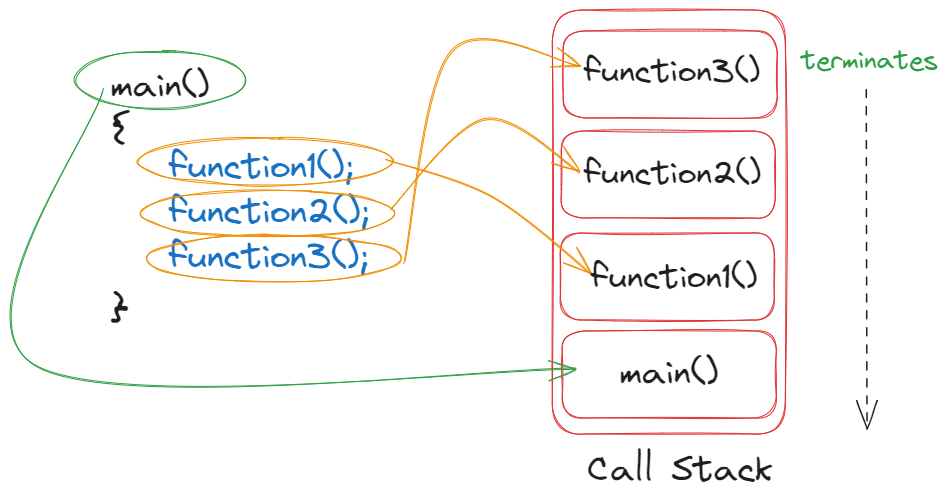

# ⚡Stack Unwinding and Standard Exceptions

## Stack Unwinding

### 

- If an exception is thrown but not caught in the current scope C++ tries to find a handler for the exception by unwinding the stack.
- Function in which the exception was not caught terminates and is removed from the call stack.
- If a `try` block was used then catch blocks are checked for a match.
- If no `try` block was used or the `catch` handler does not match, stack unwinding occurs again.
- If the stack is unwind back to `main` and no `catch` handler handles the exception, the program terminates ultimately.

### Example

```cpp
// stack unwinding example [1]

#include <iostream>

void func_a();
void func_b();
void func_c();

void func_a()
{
  std::cout << "Starting func_a" << std::endl;
  func_b();
  std::cout << "Ending func_a" << std::endl;
}

void func_b()
{
  std::cout << "Starting func_b" << std::endl;
  func_c();
  std::cout << "Ending func_b" << std::endl;
}

void func_c()
{
  std::cout << "Starting func_c" << std::endl;
  std::cout << "Ending func_c" << std::endl;
}

int main()
{
  std::cout << "Starting main" << std::endl;
  func_a();
  std::cout << "Finishing main" << std::endl;
  return 0;
}
```

```
Output:
Starting main
Starting func_a
Starting func_b
Starting func_c
Ending func_c
Ending func_b
Ending func_a
Finishing main
```

```cpp
// stack unwinding example [2]

#include <iostream>

void func_a();
void func_b();
void func_c();

void func_a()
{
  std::cout << "Starting func_a" << std::endl;
  func_b();
  std::cout << "Ending func_a" << std::endl;
}

void func_b()
{
  std::cout << "Starting func_b" << std::endl;
  func_c();
  std::cout << "Ending func_b" << std::endl;
}

void func_c()
{
  std::cout << "Starting func_c" << std::endl;
  throw 100;
  std::cout << "Ending func_c" << std::endl;
}

int main()
{
  std::cout << "Starting main" << std::endl;
  try
  {
    func_a();
  }
  catch (int &ex)
  {
    std::cout << "Caught error in main" << std::endl;
  }
  std::cout << "Finishing main" << std::endl;
  return 0;
}
```

```
Output:
Starting main
Starting func_a
Starting func_b
Starting func_c
Caught error in main
Finishing main
```

## Standard Exceptions

- In C++, the <stdexcept> header provides a set of standard exception classes that are derived from the base class std::exception.
- These classes are often referred to as "standard exceptions" and are collectively known as the <stdexcept> exceptions.
- They are designed to represent common error conditions and are meant to be thrown in exceptional situations.

## Standard Exception Classes

1. `std::exception`

   - The base class for all standard C++ exceptions.
   - It has a virtual member function what() that returns a C-style string describing the exception.

1. `std::runtime_error`

   - Represents errors that can only be detected at runtime.
   - Derived classes often used for logical errors in the program.

1. `std::logic_error`

   - Represents errors that are a result of a logical error in the program.
   - Derived classes often used for violations of logical preconditions.

1. `std::domain_error`

   - Represents errors where a function is called with an argument outside the valid domain.
   - Commonly used for mathematical domain errors.

1. `std::invalid_argument`

   - Represents errors where a function is called with an invalid argument.
   - Commonly used for parameter validation.

1. `std::length_error`

   - Represents errors where a standard library function receives a container with a size beyond its capacity.
   - For example, thrown by std::vector if it would exceed its maximum size.

1. `std::out_of_range`

   - Represents errors where an attempt is made to access an element out of the allowed range.
   - Commonly used for accessing elements in containers.

1. `std::overflow_error`

   - Represents errors where an arithmetic operation would result in an overflow.
   - Commonly used for arithmetic operations on integers.

1. `std::underflow_error`

   - Represents errors where an arithmetic operation would result in an underflow.
   - Commonly used for arithmetic operations on integers.

1. `std::bad_alloc`

   - Represents errors thrown by the new operator when it fails to allocate memory.

- These exception classes provide a way to categorize and handle different types of errors in a standardized manner.
- When an exceptional condition is detected, an object of the appropriate exception class is typically thrown, and the program can use `try`, `catch`, and `throw` to handle and propagate the exception as needed.

### Example

```cpp
// standard exception classes

#include <iostream>
#include <stdexcept>

double divideNumbers(double numerator, double denominator)
{
  if (denominator == 0)
  {
    throw std::invalid_argument("Cannot divide by zero");
  }
  return numerator / denominator;
}

int main()
{
  try
  {
    double result = divideNumbers(8, 0); // Throws std::invalid_argument
  }
  catch (const std::invalid_argument &e)
  {
    std::cerr << "Invalid Argument: " << e.what() << std::endl;
  }

  return 0;
}

```

```
Output:
Invalid Argument: Cannot divide by zero
```
