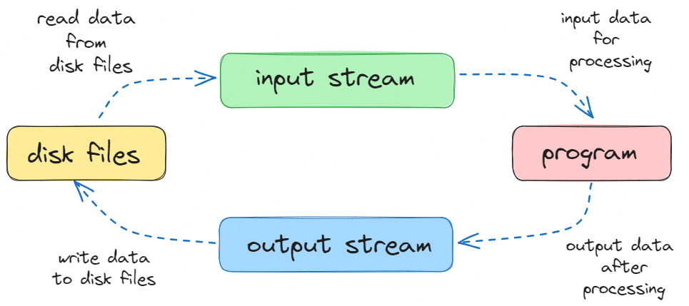
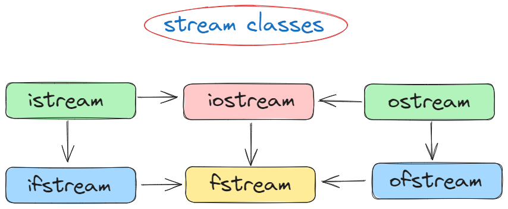

# ⚡Files in C++

## File Handling

- File handling is used to store data permanently in a computer.
- Using file handling we can store our data in secondary memory (Hard disk).

## How to achieve the File Handling

For achieving file handling we need to follow the following steps:

- Naming a file
- Opening a file
- Writing data into the file
- Reading data from the file
- Closing a file.

## Classes for File stream operations

- The I/O system of C++ contains a set of classes which define the file handling methods.
- These include `ifstream`, `ofstream` and `fstream` classes.
- These classes are derived from fstream and from the corresponding iostream class.
- These classes are designed to manage the disk files, and are declared in `<fstream>` header.

## ifstream, ofstream and fstream

1. **ifstream**

   - This class provides input operations.
   - It contains `open()` function with default input mode.
   - Inherits the functions `get()`, `getline()`, `read()`, `seekg()` and `tellg()` functions from the istream.

1. **ofstream**

   - This class provides output operations.
   - It contains open() function with default output mode.
   - Inherits the functions put(), write(), seekp() and tellp() functions from the ostream.

1. **fstream**

   - This class provides support for simultaneous input and output operations.
   - Inherits all the functions from istream and ostream classes through iostream.

In C++, files are mainly dealt by using three classes `fstream`, `ifstream`, `ofstream` available in `<fstream>` header.

- `ifstream` : Provides input operation on files
- `ofstream` : Provides output operation on files
- `fstream` : Provides both input and output operations on files simultaneously

## File input and output streams

### 

### 

## Opening a file

- A file must be opened before we can read from it or write to it.
- `ofstream` or `fstream` object is used to open a file for writing purpose.
- `ifstream` object is used to open a file for reading purpose only.

### Syntax

```cpp
stream object;
object.open(fileName, ios::openMode);

//can also be opened
stream object(fileName, ios::openMode);
```

- `fileName` specifies name and location of file to be opened.
- `ios::openMode` defines mode in which file should be opened.

## Modes

---

| Mode Flags    | Description                                                                        |
| ------------- | ---------------------------------------------------------------------------------- |
| `ios::in`     | Open a file for reading                                                            |
| `ios::out`    | Open a file for writing                                                            |
| `ios::app`    | Append Mode                                                                        |
| `ios::ate`    | Open a file for output and move read/write control to end of the file              |
| `ios::trunc`  | If the file already exists, its contents will be truncated before opening the file |
| `ios::binary` | Open a file in binary mode                                                         |

### Examples

```cpp
ofstream file;
file.open("file.txt", ios::out);
file.close(); //closing file
```

```cpp
fstream file;
file.open("file.dat", ios::out | ios::in);
file.close();//closing file
```

## Reading from and Writing to a file

## Input files

We use stream extraction operator `>>` with `ifstream` or `fstream` object to read from a file instead of `cin` object.

### Steps

1. `#include <fstream>`
1. Declare an `fstream` or `ifstream` object
1. Connect it to a file on our file system(opens it for reading)
1. Read data from the file via the stream
1. Close the stream

## Output files

We use stream insertion operator `<<` with `ofstream` or `fstream` to write to a file using `fstream` object instead of `cout` object.

### Steps

1. `#include <fstream>`
1. Declare an `fstream` or `ofstream` object
1. Connect it to a file on our file system(opens it for writing)
1. Write data to the file via the stream
1. Close the stream

### Note

- Output files will be created if they don't exists.
- Output files will be overwritten (truncated) by default.
- Output files can be opened so that new writes append.
- Output files can be opened in text or binary modes.

## Examples

```cpp
// program to open a file

#include <iostream>
#include <fstream>

int main()
{
  std::ifstream file;
  file.open("test1.txt");

  if (!file) // if test.txt is not found
  {
    std::cerr << "problem opening file" << std::endl;
    return 1; // exits the program
  }

  std::cout << "file is opened" << std::endl;
  file.close();
  return 0;
}
```

```
Output:
file is opened
```

```cpp
// program to open a file and read a string, integer, and double

#include <iostream>
#include <fstream>
#include <string>

int main()
{
  std::ifstream file;
  std::string line;
  int num;
  double total;

  file.open("test2.txt");
  if (!file)
  {
    std::cerr << "problem opening file" << std::endl;
    return 1;
  }

  file >> line >> num >> total;

  std::cout << line << std::endl;
  std::cout << num << std::endl;
  std::cout << total << std::endl;
  file.close();
  return 0;
}
```

```
test2.txt
---------
Hello 10 3.21
```

```
Output:
Hello
10
3.21
```

```cpp
// program to open a file and read a string, integer, and double in multiple lines

#include <iostream>
#include <fstream>
#include <string>

int main()
{
  std::ifstream file;
  std::string name;
  int num;
  double total;

  file.open("test3.txt");
  if (!file)
  {
    std::cerr << "problem opening file" << std::endl;
    return 1;
  }

  // eof => checks for the end of file
  while (!file.eof())
  {
    file >> name >> num >> total;
    std::cout << name << " " << num << " " << total << std::endl;
  }
  file.close();
  return 0;
}

```

```
test3.txt
---------
Ashish 100 123.1
Bishal 200 223.2
Celin 300 323.3
```

```
Output:
Ashish 100 123.1
Bishal 200 223.2
Celin 300 323.3
```

```cpp
// program to read one line at a time from a file

#include <iostream>
#include <fstream>
#include <string>

int main()
{
  std::ifstream file;
  file.open("test4.txt");

  if (!file)
  {
    std::cerr << "problem opening file" << std::endl;
    return 1;
  }

  std::string line;
  while (std::getline(file, line))
  {
    std::cout << line << std::endl;
  }
  file.close();
  return 0;
}
```

```
test4.txt
---------
I am a feather on the bright sky
I am the blue horse that runs in the plain
I am the fish that rolls, shining, in the water
I am the shadow that follows a child
I am the evening light, the lustre of meadows
```

```
Output:
I am a feather on the bright sky
I am the blue horse that runs in the plain
I am the fish that rolls, shining, in the water
I am the shadow that follows a child
I am the evening light, the lustre of meadows
```

```cpp
// program to read one character at a time from a file

#include <iostream>
#include <fstream>

int main()
{
  std::ifstream file;
  file.open("test4.txt");

  if (!file)
  {
    std::cerr << "problem opening file" << std::endl;
    return 1;
  }

  char c;
  while (file.get(c))
  {
    std::cout << c;
  }
  file.close();
  return 0;
}
```

```
test4.txt
---------
I am a feather on the bright sky
I am the blue horse that runs in the plain
I am the fish that rolls, shining, in the water
I am the shadow that follows a child
I am the evening light, the lustre of meadows
```

```
Output:
I am a feather on the bright sky
I am the blue horse that runs in the plain
I am the fish that rolls, shining, in the water
I am the shadow that follows a child
I am the evening light, the lustre of meadows
```

```cpp
// program to write in a file

#include <iostream>
#include <fstream>
#include <string>

int main()
{
  std::ofstream file("test5.txt");
  if (!file)
  {
    std::cerr << "error creating file" << std::endl;
    return 1;
  }
  std::string line;
  std::cout << "Enter something to write on a file: ";

  std::getline(std::cin, line);
  file << line << std::endl;

  file.close();
  return 0;
}
```

```
Output:
Enter something to write on a file: Education beats beauty
```

```
test5.txt
---------
Education beats beauty
```

```cpp
// program to append in a file

#include <iostream>
#include <fstream>
#include <string>

int main()
{
  std::ofstream file("test6.txt", std::ios::app);
  if (!file)
  {
    std::cerr << "error creating file" << std::endl;
    return 1;
  }
  std::string line;
  std::cout << "Enter something to write on a file: ";

  std::getline(std::cin, line);
  file << line << std::endl;

  file.close();
  return 0;
}
```

```
test6.txt (before)
---------
This is my first line
```

```
Output:
Enter something to write on a file: This is my append line
```

```
test6.txt (after append)
---------
This is my first line
This is my append line
```

```cpp
// program to copy file using getline

#include <iostream>
#include <fstream>
#include <string>

int main()
{
  std::ifstream original("original.txt");
  std::ofstream copied("copied.txt");

  if (!original || !copied)
  {
    std::cerr << "error opening file" << std::endl;
    return 1;
  }

  std::string line;
  while (std::getline(original, line))
  {
    copied << line << std::endl;
  }

  std::cout << "file copied successfully" << std::endl;
  original.close();
  copied.close();

  return 0;
}
```

```
original.txt
------------
I am a feather on the bright sky
I am the blue horse that runs in the plain
I am the fish that rolls, shining, in the water
I am the shadow that follows a child
I am the evening light, the lustre of meadows
```

```
Output:
file copied successfully
```

```
copied.txt (after copying)
----------
I am a feather on the bright sky
I am the blue horse that runs in the plain
I am the fish that rolls, shining, in the water
I am the shadow that follows a child
I am the evening light, the lustre of meadows
```

```cpp
// program to copy file using get() and put()

#include <iostream>
#include <fstream>

int main()
{
  std::ifstream original("original.txt");
  std::ofstream copied("copied.txt");

  if (!original || !copied)
  {
    std::cerr << "error opening file" << std::endl;
    return 1;
  }

  char c;
  while (original.get(c))
  {
    copied.put(c);
  }

  std::cout << "file copied successfully" << std::endl;
  original.close();
  copied.close();

  return 0;
}
```

```
original.txt
------------
I am a feather on the bright sky
I am the blue horse that runs in the plain
I am the fish that rolls, shining, in the water
I am the shadow that follows a child
I am the evening light, the lustre of meadows
```

```
Output:
file copied successfully
```

```
copied.txt (after copying)
----------
I am a feather on the bright sky
I am the blue horse that runs in the plain
I am the fish that rolls, shining, in the water
I am the shadow that follows a child
I am the evening light, the lustre of meadows
```

## File Pointers

The `std::fstream` class provides member functions `seekg()`, `tellg()`, `seekp()` and `tellp()` for positioning the read and write pointers within a file.

1. `seekg()`
   - This function is member of `ifstream`.
   - It is used to set the read pointer to a specific position.
1. `tellg()`
   - This function is member of `ifstream`.
   - It is used to get the current read position.
1. `seekp()`
   - This function is member of `ofstream`.
   - It is used to set the write pointer to a specific position.
1. `tellp()`
   - This function is member of `ofstream`.
   - It is used to get the current write position.

### Reference Pointers for `seekg()` and `seekp()`

- `ios::beg` : to move from beginning of file
- `ios::cur` : to move from current position in the file
- `ios::end` : to move from end of file

### Syntax

```cpp
seekg(numberOfBytes, referencePointer);

seekp(numberOfBytes, referencePointer);

fileObject.tellg();

fileObject.tellp();
```

### Examples

```cpp
// seekg() and tellg() for reading

#include <iostream>
#include <fstream>

int main()
{
  std::ifstream inputFile("read.txt"); // read.txt => Education beats beauty

  // Check if the file is successfully opened
  if (inputFile.is_open())
  {
    // Move the read pointer to the 5th character (4th index) from the beginning
    inputFile.seekg(4, std::ios::beg);

    // Get the current read position
    int readPos = inputFile.tellg();
    std::cout << "Current read position: " << readPos << "\n"; // 4

    // Read and display content from the specified position
    std::string content;
    inputFile >> content;
    std::cout << "Content from position 5: " << content << "\n"; // ation

    inputFile.close();
  }
  else
  {
    std::cerr << "Error opening the file.\n";
  }

  return 0;
}
```

```
read.txt
--------
Education beats beauty
```

```
Output:
Current read position: 4
Content from position 5: ation
```

```cpp
// seekp() and tellp() for writing

#include <iostream>
#include <fstream>

int main()
{
  // open file for writing and append mode
  std::fstream outputFile("write.txt", std::ios::out | std::ios::app);

  // Check if the file is successfully opened
  if (outputFile.is_open())
  {
    // Write some initial content to the file
    outputFile << "Initial content.\n";

    // Move the write pointer to the end of the file
    outputFile.seekp(0, std::ios::end);

    // Get the current write position
    int writePos = outputFile.tellp();
    std::cout << "Current write position: " << writePos << "\n";

    // Append additional content at the end
    outputFile << "Additional content at the end.\n";

    // Close the file
    outputFile.close();
  }
  else
  {
    std::cerr << "Error opening the file.\n";
  }

  return 0;
}
```

```
Output:
Current write position: 68
```

```
write.txt
---------
Initial content.
Additional content at the end.
```

## Binary File

In case of binary files, we will use the `ios::binary` file mode while opening a file.

### Example

```cpp
int main()
{
   ifstream file;
   file.open("test.dat", std::ios::binary);
}
```

## Writing to a binary file

- The ofstream class provides a member function named `write()` that allows for information to be written in binary form to the stream.
- This function is used to write a block of binary data or write fixed number of bytes.

### Syntax

```cpp
ofstream& write((char*)& buffer, int sizeof(buffer));
```

### Example

```cpp
// program to write block data to a file

#include <iostream>
#include <fstream>
#include <cstring>

class Student
{
  int roll;
  char name[20];
  float gpa;

public:
  Student() = default;
  Student(int r, const char *n, float g)
  {
    roll = r;
    strcpy(name, n);
    gpa = g;
  }

  void showInfo()
  {
    std::cout << "Roll: " << roll << std::endl;
    std::cout << "Name: " << name << std::endl;
    std::cout << "GPA: " << gpa << std::endl;
  }
};

int main()
{
  std::ofstream file;
  file.open("student.dat", std::ios::binary);
  if (!file)
  {
    std::cerr << "problem opening file" << std::endl;
    return 1;
  }

  Student Bishal(1, "Bishal Baniya", 3.90);

  // writing block data to a file
  file.write((char *)&Bishal, sizeof(Bishal));

  std::cout << "info added successfully" << std::endl;
  file.close();
  return 0;
}
```

```
Output:
info added successfully
```

## Reading from a binary file

- The istream class provides a member function named `read()` that allows to read block of binary data from a file.

### Syntax

```cpp
ifstream& read((char*)& buffer, int sizeof(buffer));
```

### Example

```cpp
// program to read block data from a file

#include <iostream>
#include <fstream>
#include <cstring>

class Student
{
  int roll;
  char name[20];
  float gpa;

public:
  Student() = default;
  Student(int r, const char *n, float g)
  {
    roll = r;
    strcpy(name, n);
    gpa = g;
  }

  void showInfo()
  {
    std::cout << "Roll: " << roll << std::endl;
    std::cout << "Name: " << name << std::endl;
    std::cout << "GPA: " << gpa << std::endl;
  }
};

int main()
{
  std::ifstream file;
  file.open("student.dat", std::ios::binary);
  if (!file)
  {
    std::cerr << "problem opening file" << std::endl;
    return 1;
  }

  Student Bishal;

  // reading block data from a file
  file.seekg(0, std::ios::beg); // moves file pointer to beginning
  file.read((char *)&Bishal, sizeof(Bishal));

  Bishal.showInfo();
  file.close();
  return 0;
}
```

```
Output:
Roll: 1
Name: Bishal Baniya
GPA: 3.9
```
