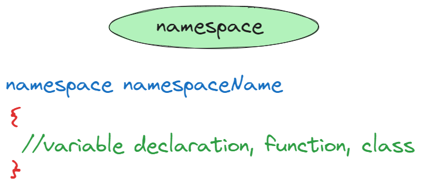

# ⚡Namespace in C++

## Namespace

- Namespace provide the space where we can define or declare identifier i.e. variable, method, classes.
- Namespaces provide a method for preventing name conflicts in large projects.
- Entities declared inside a namespace block are placed in a namespace scope, which prevents them from being mistaken for identically-named entities in other scopes.
- Namespaces in C++ are used as additional information to differentiate two or more variables, functions, or classes having the same names.

## Defining a Namespace in C++

### 

- Creating a namespace in C++ is similar to creating a class.
- We use the keyword `namespace` followed by the name of the namespace to define a namespace in C++.

```cpp
namespace MyNamespace {
    // Function, class, and variable declarations.
}
```

In the scope of the namespace, we can declare variables, functions, user-defined data types (like classes), and even nested namespaces.

## Using a Namespace in C++

There are three ways to use a namespace in C++.

1. Using Scope Resolution Operator
1. Using Directive
1. Using Declaration

## Using Scope Resolution Operator (`::`)

- The scope resolution operator ( `::` ) can be used with the name of the namespace to call/access any member (variable, function, or class) declared inside a namespace.

### Example

```cpp
// namespace using scope resolution operator (::)

#include <iostream>

namespace ns1
{
  void greet()
  {
    std::cout << "Hello from namespace ns1." << std::endl;
  }
}

namespace ns2
{
  void greet()
  {
    std::cout << "Hello from namespace ns2." << std::endl;
  }

  int var = 10;

  int func()
  {
    return var * 3;
  }
}

int main()
{
  // Run the greet() function present in ns1
  ns1::greet();

  // Run the greet() function present in ns2
  ns2::greet();

  return 0;
}

```

```
Output:
Hello from namespace ns1.
Hello from namespace ns2.
```

- In the above example, we defined two namespaces - `ns1` and `ns2`. These namespaces had the same function, `greet()`, inside them.
- In the main program, we called both these functions using each namespace's name and the scope resolution operator.

## Using Directive

- With the help of using namespace directive, we can import an entire namespace from another program file into our program file.
- The imported namespace will have a global scope. We can also use this directive to import a namespace into another namespace or even another program.

### Syntax

```cpp
using namespace namespace_name;
```

### Example

Say we have a header file named `mynamespace.h` that contains the namespace School.

```cpp
// mynamespace.h
namespace Employee
{
int employeeCapacity = 500;

    class Employees
    {
        int totalEmployees = 350;
    };
}
```

Let us include the above file in a C++ program named `namespace2.cpp`

```cpp
// namespace2.cpp

// including the header file.
#include "mynamespace.h"

int main()
{
  // using directive.
  using namespace Employee;

  /*
  Now, all variables, functions, and classes are in the namespace
  Employee can be directly used here.
  */

  Employees e1;

  return 0;
}
```

## Using Declaration

- The using declaration differs slightly from the using directive.
- In the using declaration, we only import one namespace member at a time with the help of the scope resolution operator.
- The member imported is only available in the current scope.
- A namespace member (having a particular name) imported with using declaration can override the same member imported with using directive.

### Syntax

```cpp
using namespace_name::member_name;
```

### Example

Consider a file named `mynamespace2.h` that contains the following code:

```cpp
// mynamespace2.h
namespace ns1
{
  void print_text()
  {
    cout << "This function is inside namespace ns1" << endl;
  }

  void hello()
  {
    cout << "Hello from namespace ns1" << endl;
  }

}

namespace ns2
{
  void print_text()
  {
    cout << "This function is inside namespace ns2" << endl;
  }

  void hello()
  {
    cout << "Hello from namespace ns2" << endl;
  }

}
```

We will now import this file to our `namespace3.cpp` file:

```cpp
// namespace3.cpp
#include <iostream>
#include "mynamespace2.h"

using namespace std;

using namespace ns1; // using directive

int main()
{
  using ns2::print_text; // using declaration

  // calling print_text() function
  print_text();

  // calling the hello() function
  hello();

  return 0;
}
```

```
Output:
This function is inside namespace ns2
Hello from namespace ns1
```

## Discontiguous Namespaces in C++

- We can define namespaces in various program parts that can even be spread over multiple files.
- This is known as a Discontiguous namespace.
- The entire namespace is considered as the sum of its separately defined parts.

### Example

```cpp
// discontiguous Namespaces in C++

#include <iostream>
using namespace std;

// 1st part of the namespace
namespace ns
{
  int var = 20;
}

// 2nd part of the namespace ns
namespace ns
{
  void func()
  {
    cout << "The value of var is: " << var << endl;
  }
}

int main()
{
  cout << ns::var << endl;
  ns::func();

  return 0;
}
```

```
Output:
20
The value of var is: 20
```

## C++ Nested Namespaces

- Namespaces in C++ can be nested.
- It means that we can create namespaces inside the scope of another namespace.

### Syntax

```cpp
namespace outer_ns
{
    // Declaration of members of outer_ns.

    namespace inner_ns
    {
        // Declaration of members of inner_ns.
    }
}
```

We can access the members of the nested namespace by `outer_ns::inner_ns::inner_ns_member_name`.

### Example

```cpp
// nested namespaces

#include <iostream>
using namespace std;

namespace outer_ns
{
  int outer = 10;
  namespace inner_ns
  {
    int inner = 20;
  }
}

int main()
{
  // outer_ns namespace
  cout << outer_ns::outer << endl;

  // inner_ns namespace
  cout << outer_ns::inner_ns::inner << endl;

  return 0;
}
```

```
Output:
10
20
```

## Classes in Namespace

We can create classes inside namespaces.

### Example

```cpp
// class inside namespace

#include <iostream>
using namespace std;

namespace ns
{
  // a class in a namespace
  class Printer
  {
  public:
    void print_text()
    {
      cout << "print_text() function is executed." << endl;
    }
  };
}

int main()
{
  // creating an object of the class Printer
  ns::Printer p;

  // calling the print_text() function
  p.print_text();

  return 0;
}
```

```
Output:
print_text() function is executed.
```

We can even declare classes inside a namespace but define them outside it.

### Example

```cpp
// defining class outside namespace

#include <iostream>
using namespace std;

namespace ns
{
  // declaring the class inside the namespace
  class Printer;
}

// defining the class outside the namespace
class ns::Printer
{
public:
  void print_text()
  {
    cout << "Defining classes outside the namespace.";
  }
};

int main()
{
  // creating object of Printer class
  ns::Printer obj;

  obj.print_text();

  return 0;
}
```

```
Output:
Defining classes outside the namespace.
```

## The Global Namespace

- When we declare a global variable (say int var), we can say that var is in the global namespace.
- The terms global namespace and global scope are often used interchangeably as they are more or less similar.
- The members of a global namespace can be accessed using the scope resolution operator ( :: ). We do not need to mention a namespace name to access these members.

### Example

```cpp
// global namespace

#include <iostream>
using namespace std;

/*
var is defined in the global namespace, i.e.,
this variable exists everywhere in the program
*/
int var = 10;

namespace ns
{
  int var = 20;
}

int main()
{
  cout << ::var << endl;   // global namespace
  cout << ns::var << endl; // ns namespace
  return 0;
}
```

```
Output:
10
20
```

## Defining Methods Outside the Namespace

- We can declare class methods or functions inside and define them outside the namespace block.

### Example

```cpp
// defining methods outside the namespace

#include <iostream>
using namespace std;

namespace ns
{
  // declaring a function
  void func1();

  class Printer
  {
  public:
    // declaring a method
    void func2();
  };

}

// defining func1()
void ns::func1()
{
  cout << "func1() executed successfully" << endl;
}

// defining func2()
void ns::Printer::func2()
{
  cout << "func2() executed successfully" << endl;
}

int main()
{
  // creating an object to execute func2().
  ns::Printer obj;

  // executing func1().
  ns::func1();

  // executing func2().
  obj.func2();

  return 0;
}
```

```
Output:
func1() executed successfully
func2() executed successfully
```

## Namespace Alias

- Sometimes the namespace names can be too long.
- Hence it becomes hectic to write these long names again and again to access the namespace members, especially when we are using nested namespaces.
- To avoid this problem, we can use namespace aliases. Aliases are alternate names that we can use instead of the original namespace names.
- Aliases can be created for both outer (enclosing) and inner namespaces.

### Syntax

```cpp
namespace alias_name = namespace_name;
```

### Example

```cpp
// namespace alias

#include <iostream>
using namespace std;

namespace outer_ns
{
  void func1()
  {
    cout << "This function is inside the outer namespace." << endl;
  }

  namespace inner_ns
  {
    void func2()
    {
      cout << "This function is inside the inner namespace." << endl;
    }
  }

}

// creating an alias for an outer namespace
namespace o_ns = outer_ns;

// creating an alias for an inner namespace
namespace i_ns = outer_ns::inner_ns;

int main()
{
  // calling func1() from outer namespace
  o_ns::func1();

  // calling func2() from inner namespace
  // no need to write o_ns::i_ns::func2()
  // equivalent to outer_ns::inner_ns::func2()
  i_ns::func2();

  return 0;
}
```

```
Output:
This function is inside the outer namespace.
This function is inside the inner namespace.
```

## Standard Namespace

- In most of our C++ programs, we usually write `using namespace std`.
- This `namespace std` is in the iostream header file.
- The `std` stands for standard.
- The `iostream` header file contains a lot of commonly used members like `cout`, `cin`, `endl`, etc.
- So to avoid writing `std::cout` or `std::endl` again and again, we usually add the using directive - `using namespace std;` in our programs.
- Instead of employing the using directive (`using namespace std`), we can even use the using declaration (using `std::cout`) only to import the commonly used iostream file members.
- This can help us avoid naming conflicts as we may create functions or classes in our program with names already existing in the `std namespace`.

## Advantages of Namespace

- **Ease in using libraries**:
  Namespaces help us use different libraries together in one program and differentiate between variable names using the scope resolution operator.
- **Reusable variable names**:
  We can use the same variable names multiple times in one C++ program.
- **Enhance code readability**:
  We can specify similar code in different files and libraries using a namespace to enhance the code readability.

## Disadvantages of Namespace

- **Ambiguous function calls**:
  If functions are defined in multiple places, they could be called ambiguously because of the namespace.
- **Problems with the using directive**:
  If we use the using directive in our programs, it may lead to unexpected program behavior.
