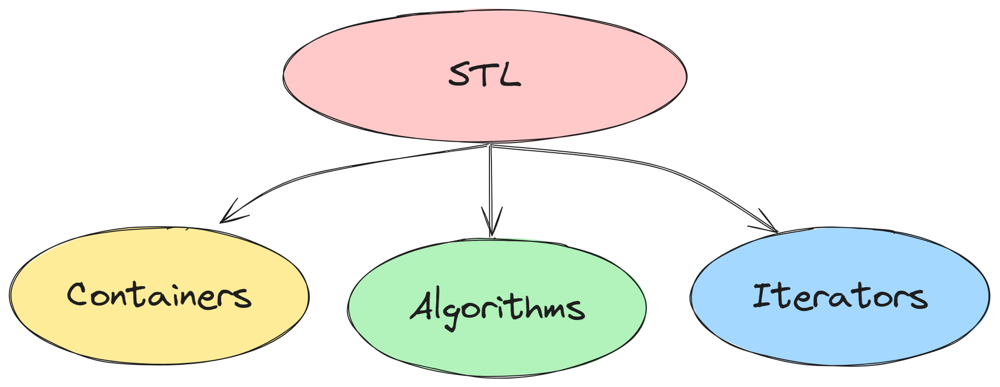

# ⚡Introduction to STL

## STL

### 

- STL refers to Standard Template Library.
- It is a library of powerful, reusable, adaptable, generic classes and functions.
- It is implemented using C++ templates.
- It contains set of C++ template classes to provide common programming data structures and functions such as lists, stacks, arrays, etc.
- It is consistent, fast, type-safe and extensible.

## Elements of the STL

1. **Containers**
   - Collections of objects or primitive types.
   - Examples: array, vector, deque, stack, set, map, etc.
1. **Algorithms**
   - Functions for processing sequences of elements from containers.
   - Examples: find, max, count, accumulate, sort, etc.
1. **Iterators**
   - Generate sequences of element from containers.
   - Examples: forward, reverse, by value, by reference, constants, etc.

### Examples

```cpp
// simple example to sort a vector using STL

#include <iostream>
#include <vector>
#include <algorithm>

int main()
{
  std::vector<int> v{3, 2, 1};
  std::sort(v.begin(), v.end());

  for (auto elem : v)
  {
    std::cout << elem << std::endl;
  }

  return 0;
}
```

```
Output:
1
2
3
```

```cpp
// simple example to reverse a vector using STL

#include <iostream>
#include <vector>
#include <algorithm>

int main()
{
  std::vector<int> v{8, 7, 3};
  std::reverse(v.begin(), v.end());

  for (auto elem : v)
  {
    std::cout << elem << std::endl;
  }

  return 0;
}
```

```
Output:
3
7
8
```

```cpp
// simple example to calculate sum of vector elements using STL

#include <iostream>
#include <vector>
#include <numeric>

int main()
{
  int sum{};
  std::vector<int> v{3, 2, 1};
  sum = std::accumulate(v.begin(), v.end(), 0);

  std::cout << "Sum: " << sum << std::endl;

  return 0;
}
```

```
Output:
Sum: 6
```

## Types of containers

1. **Sequence Containers**
   - array, vector, list, forward_list, deque
1. **Associative Containers**
   - set, multi set, map, multi map
1. **Container adapters**
   - stack, queue, priority queue

## Types of iterators

Iterators are objects that are used to access elements of a container.

- **Input Iterators:** from the container to the program
- **Output Iterators:** from the program to the container
- **Forward Iterators:** navigate one item at a time in one direction
- **Bi-directional Iterators:** navigate one item at a time both directions
- **Random access Iterators:** directly access a container item

## Types of Algorithms

- An algorithm is a series of instructions to solve a particular problem.
- There are about 60 algorithms in the STL.
- They are of two types: Non-modifying and Modifying.
- Examples: Sorting algorithms, Searching algorithms, Copying algorithms, Counting algorithms, etc.
