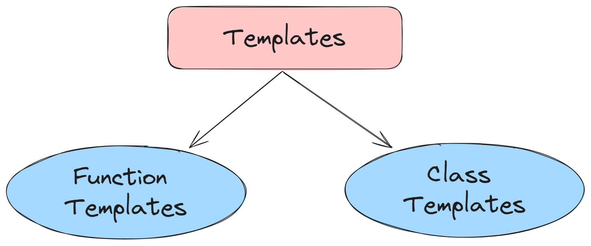

# ⚡Templates in C++

## Templates

### 

- A C++ template is a powerful feature added to C++.
- It allows you to define the generic classes and generic functions and thus provides support for generic programming.
- Generic programming is a technique where generic types are used as parameters in algorithms so that they can work for a variety of data types.

## Types of Templates

- Function Templates
- Class Templates

### Function Templates

We can define a template for a function. For example, if we have an `add()` function, we can create versions of the add function for adding the `int`, `float` or `double` type values.

### Class Templates

We can define a template for a class. For example, a class template can be created for the array class that can accept the array of various types such as `int` array, `float` array or `double` array.
